# สัปดาห์ที่ 10: การตอบสนองต่อเหตุการณ์ความปลอดภัย
## Security Incident Response for Software Engineers

**หลักสูตร:** ENGSE214 ความมั่นคงปลอดภัยทางไซเบอร์เบื้องต้น  
**สำหรับ:** วิศวกรรมซอฟต์แวร์ ปี 3  
**จำนวนชั่วโมง:** 3 ชั่วโมง (30 สไลด์)

---

## 📋 วัตถุประสงค์การเรียนรู้

หลังจากสิ้นสุดการเรียน นักศึกษาจะสามารถ:

1. **เข้าใจขั้นตอน Incident Response** ตามมาตรฐานสากล
2. **ปฏิบัติการเก็บหลักฐานดิจิทัล** แบบเบื้องต้น
3. **วางแผน Disaster Recovery** สำหรับระบบซอฟต์แวร์
4. **จัดการวิกฤต** เมื่อเกิดเหตุการณ์ไซเบอร์
5. **ประยุกต์ใช้** ในการออกแบบซอฟต์แวร์ที่ปลอดภัย

---

## Slide 1: เปิดบทเรียน - ทำไมต้องเรียนเรื่องนี้?

### 🚨 เหตุการณ์จริงที่เกิดขึ้นในประเทศไทย

**กรณี 1: บริษัท A (2023)**
- ระบบ HR ถูกโจมตีด้วย Ransomware
- ข้อมูลพนักงาน 50,000 คน รั่วไหล
- ปิดระบบ 3 วัน ขาดทุน 20 ล้านบาท
- **ปัญหา**: ไม่มีแผนรับมือ ไม่รู้จะทำอะไรดี

**กรณี 2: สถาบันการศึกษา B (2024)**  
- เว็บไซต์ลงทะเบียนถูกแฮก
- ข้อมูลนักศึกษาถูกขายในตลาดมืด
- ต้องแจ้ง สำนักงาน ปปส. ตาม พ.ร.บ. คุ้มครองข้อมูลส่วนบุคคล
- **ปัญหา**: ไม่รู้ว่าต้องแจ้งใครบ้าง แจ้งเมื่อไหร่

### 🎯 คำถามสำคัญ
> "ถ้าระบบที่คุณพัฒนาถูกโจมตี คุณจะรู้ได้ยังไง และต้องทำอะไรก่อน?"

**สถิติที่น่าตกใจ:**
- ใช้เวลาเฉลี่ย **200+ วัน** กว่าจะรู้ว่าถูกแฮก
- **60%** ของ SME ปิดตัวภายใน 6 เดือนหลังถูกโจมตี
- ค่าใช้จ่ายเฉลี่ย **15 ล้านบาท** ต่อเหตุการณ์

---

## Slide 2: Incident คืออะไร?

### 🔍 ความหมายพื้นฐาน

**Security Incident** = เหตุการณ์ที่ทำให้ระบบคอมพิวเตอร์ไม่ปลอดภัย

**ตัวอย่างที่เข้าใจง่าย:**

#### 🏠 เปรียบเทียบกับบ้าน
| บ้าน | ระบบคอมพิวเตอร์ |
|------|-----------------|
| ขโมยเข้าบ้าน | แฮกเกอร์เข้าระบบ |
| ขโมยของ | ขโมยข้อมูล |
| ทำลายของใช้ | ทำลายไฟล์ |
| บ้านไฟไหม้ | ระบบล่ม |

### 📊 ประเภทของ Incident (จากง่ายไปยาก)

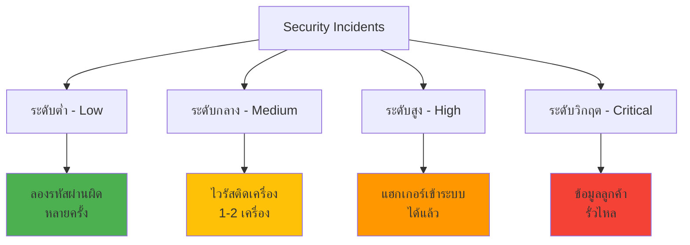

---

## Slide 3: ทำไมต้องมี Incident Response Plan?

### 🎯 เหตุผลสำคัญ

#### 1. **กฎหมายบังคับ**
- **พ.ร.บ. คุ้มครองข้อมูลส่วนบุคคล**: ต้องแจ้ง สำนักงาน ปปส. ภายใน **72 ชั่วโมง**
- **พ.ร.บ. ความมั่นคงปลอดภัยไซเบอร์**: องค์กรสำคัญต้องมีแผนรับมือ
- หากไม่ทำตาม ปรับได้ถึง **5 ล้านบาท**

#### 2. **ลดความเสียหาย**  
- **ไม่มีแผน**: เสียเงิน 20 ล้าน, เสียเวลา 30 วัน
- **มีแผน**: เสียเงิน 5 ล้าน, เสียเวลา 7 วัน
- **ประหยัดได้ 75%!**

#### 3. **รักษาชื่อเสียง**
- ลูกค้าไว้วางใจบริษัทที่จัดการวิกฤตได้ดี
- สื่อมองในแง่บุกเมื่อเห็นความพยายามแก้ไข

### 📈 ตัวอย่างจริง: บริษัท Central Group (2021)
- ถูกโจมตีแต่รับมือได้ดี
- แจ้งลูกค้าอย่างโปร่งใส
- กู้คืนระบบได้ภายใน 48 ชั่วโมง
- **ผลลัพธ์**: ลูกค้ายังไว้วางใจ ไม่ส่งผลกระทบระยะยาว

---

## Slide 4: NIST Framework - แผนรับมือมาตรฐานโลก

### 📘 4 ขั้นตอนหลัก (ง่าย ๆ)

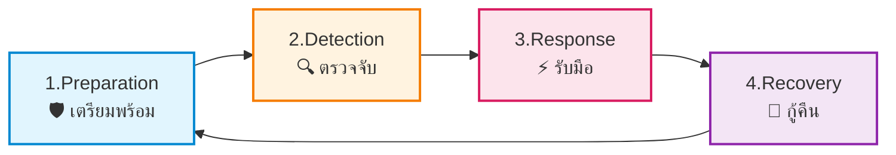

### 🔄 **เหมือนการออกกำลังกาย 4 ขั้น**

1. **Preparation** = **เตรียมอุปกรณ์** (รองเท้า, เสื้อผ้า, น้ำ)
2. **Detection** = **เช็คอาการ** (เหนื่อยไหม, เจ็บไหม)  
3. **Response** = **หยุดพัก** (เมื่อรู้ว่าเหนื่อยเกินไป)
4. **Recovery** = **กู้คืนสภาพ** (นวดกล้ามเนื้อ, ดื่มน้ำ)

### 🎯 **ทำไมเป็นวงจร?**
- เรียนรู้จากครั้งก่อน → เตรียมพร้อมครั้งหน้าให้ดีขึ้น
- ไม่ใช่ทำครั้งเดียวแล้วจบ
- **การปรับปรุงอย่างต่อเนื่อง**

---

## Slide 5: Phase 1 - Preparation (เตรียมพร้อม)

### 🛡️ เตรียมพร้อมอะไรบ้าง?

#### 1. **ทีมงาน (Incident Response Team)**
**เหมือนทีมดับเพลิง** - แต่ละคนมีหน้าที่ชัดเจน

| บทบาท | หน้าที่ | ตัวอย่าง |
|--------|---------|----------|
| **หัวหน้าทีม** | สั่งการ ติดต่อผู้บริหาร | ผู้จัดการ IT |
| **นักสืบ** | หาสาเหตุ เก็บหลักฐาน | Software Engineer |  
| **หมอฉุกเฉิน** | แก้ระบบ กู้คืนข้อมูล | System Admin |
| **โฆษก** | แจ้งข่าว สื่อสาร | PR/Marketing |

#### 2. **อุปกรณ์และเครื่องมือ**
**เหมือนกล่องปฐมพยาบาล**

**สิ่งที่ต้องเตรียม:**
- 📞 **เบอร์โทรฉุกเฉิน** (ตำรวจไซเบอร์, ผู้เชี่ยวชาญ)
- 💾 **Backup ล่าสุด** (เก็บแยกสถานที่)
- 🔍 **Log ระบบ** (บันทึกการใช้งาน)
- 📋 **คู่มือขั้นตอน** (Step-by-step)

#### 3. **แผนรับมือ (Incident Response Plan)**
**เหมือนแผนหนีไฟ** - ต้องรู้ว่าเมื่อไหร่ต้องทำอะไร

```
🔥 เมื่อเกิดเหตุ:
Step 1: กดสัญญาณเตือน (แจ้งทีม)
Step 2: ดูว่าไฟลามไปไหน (ประเมินความรุนแรง)
Step 3: ดับไฟ (หยุดการโจมตี)  
Step 4: ช่วยคนออกมา (กู้คืนข้อมูล)
Step 5: หาสาเหตุไฟไหม้ (วิเคราะห์)
```

---

## Slide 6: เตรียมพร้อมสำหรับ Software Engineers

### 💻 สิ่งที่ Software Engineers ควรเตรียม

#### 1. **ทำ Log ให้ดี**
**Log = บันทึกการทำงานของระบบ**

**❌ Log แบบไม่ดี:**
```
[INFO] User login
[ERROR] Database error  
[INFO] User logout
```

**✅ Log แบบดี:**
```
[2024-09-24 14:30:25] [INFO] User 'john.doe' login from IP 192.168.1.100 - SUCCESS
[2024-09-24 14:35:10] [ERROR] Database connection failed - Host 'db.company.com' timeout after 30s
[2024-09-24 14:40:15] [INFO] User 'john.doe' logout - Session duration: 9m 50s
```

**ทำไม Log ดีถึงสำคัญ?**
- เวลาถูกแฮก จะรู้ได้ว่า **ใครทำอะไร เมื่อไหร่**
- เหมือน **กล้องวงจรปิด** ของระบบคอมพิวเตอร์

#### 2. **ระบบ Monitor และ Alert**
**เหมือนหูฟังของหมอ** - ต้องรู้ทันทีเมื่อมีอาการผิดปกติ

**ตัวอย่างสิ่งที่ควรตื่นตัว:**
- มีคนลองรหัสผ่านผิด **20 ครั้ง ใน 5 นาที**
- ใช้ CPU **90%+ เป็นเวลา 10 นาที**  
- Download ข้อมูล **100 GB ใน 1 ชั่วโมง**
- เข้าถึงไฟล์ **2,000 ไฟล์ ใน 30 วินาที**

#### 3. **การออกแบบระบบที่รับมือได้**
**หลัก "ประตูกั้น"** - ถ้าประตูหนึ่งเสีย ยังมีประตูอื่น

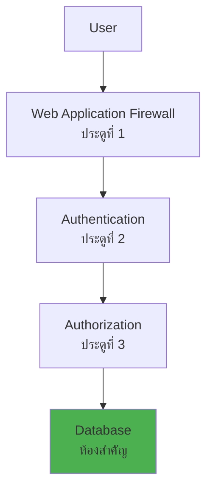

**ตัวอย่างการใช้:**
- ถึงแม้แฮกเกอร์ผ่าน Firewall ได้ แต่ยังต้องล็อกอิน
- ถึงแม้ล็อกอินได้ แต่ไม่มีสิทธิ์เข้าข้อมูลสำคัญ

---

## Slide 7: Phase 2 - Detection & Analysis (ตรวจจับและวิเคราะห์)

### 🔍 รู้ได้อย่างไรว่าถูกโจมตี?

#### 1. **สัญญาณเตือนอัตโนมัติ**
**เหมือนสัญญาณเตือนโจรกรรม**

**ตัวอย่างสัญญาณ:**
- ⚠️ **Alert: Failed login 50 times from same IP**
- ⚠️ **Alert: Database accessed at 3:00 AM**  
- ⚠️ **Alert: 1000 files deleted in 5 minutes**
- ⚠️ **Alert: Unknown process consuming 95% CPU**

#### 2. **คนแจ้งมา**
**แหล่งข้อมูลจากคน:**

| ใครแจ้ง | ตัวอย่าง |
|---------|----------|
| **พนักงาน** | "คอมพิวเตอร์ช้า ไฟล์เปิดไม่ได้" |
| **ลูกค้า** | "เว็บไซต์แปลกๆ มีโฆษณาแปลกๆ" |
| **คู่ค้า** | "ได้อีเมล์ spam จากบริษัทคุณ" |
| **หน่วยงานภายนอก** | "ThaiCERT แจ้งว่าเซิร์ฟเวอร์คุณส่ง malware" |

#### 3. **การจำแนกความรุนแรง**
**เหมือนการแยกสีในโรงพยาบาล**

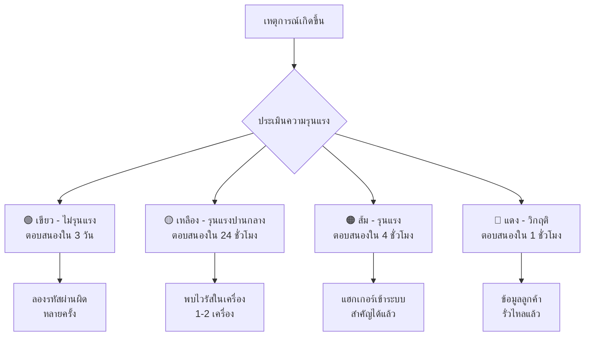

#### 4. **การวิเคราะห์เบื้องต้น**
**ถามคำถาม 5W1H:**

- **Who** (ใคร): ผู้โจมตี มาจาก IP ไหน?
- **What** (อะไร): ข้อมูลอะไรถูกคุกคาม?  
- **When** (เมื่อไหร่): เกิดขึ้นเวลาไหน?
- **Where** (ที่ไหน): ระบบไหนที่ถูกโจมตี?
- **Why** (ทำไม): วัตถุประสงค์อะไร (เงิน? ข้อมูล? ก่อวินาศกรรม?)
- **How** (อย่างไร): วิธีการโจมตีแบบไหน?

---

## Slide 8: การเก็บหลักฐานดิจิทัล - Computer Forensics พื้นฐาน

### 🔬 Computer Forensics คืออะไร?

**เหมือนนิติเวชศาสตร์** แต่สำหรับคอมพิวเตอร์
- **นิติเวชศาสตร์**: หาสาเหตุการตาย จากศพ
- **Computer Forensics**: หาสาเหตุการโจมตี จากคอมพิวเตอร์

### 📋 6 ขั้นตอนการเก็บหลักฐาน

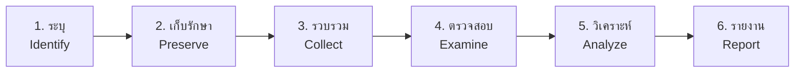

#### **ขั้นตอนละเอียด (อธิบายง่าย ๆ):**

**1. Identify (ระบุ)** - หาของที่เป็นหลักฐาน
- เครื่องคอมพิวเตอร์ที่ถูกโจมตี
- ไฟล์ Log ของระบบ  
- อีเมล์ที่น่าสงสัย
- USB, Hard Drive ที่เกี่ยวข้อง

**2. Preserve (เก็บรักษา)** - รักษาหลักฐานให้คงเดิม
- **ห้ามแตะต้อง** เครื่องที่ถูกโจมตี
- ถ่ายรูป screenshot หน้าจอ
- ถอดปลั๊กไฟ (อย่าปิดผ่าน software)
- เก็บในถุงพิเศษ มีป้ายระบุ

**3. Collect (รวบรวม)** - ทำสำเนาหลักฐาน
- **Copy** ข้อมูลในฮาร์ดไดรฟ์ **ทั้งหมด**
- ไม่ใช่ copy แค่ไฟล์ที่เห็น แต่รวมไฟล์ที่ลบแล้วด้วย
- สร้าง **Checksum** (ตัวเลขที่ใช้ยืนยันว่าข้อมูลไม่เปลี่ยนแปลง)

**4. Examine (ตรวจสอบ)** - ดูว่ามีอะไรบ้าง
- เปิดดูไฟล์ต่าง ๆ
- กู้คืนไฟล์ที่ถูกลบ
- ดู Browser history, Email

**5. Analyze (วิเคราะห์)** - ต่อเหตุการณ์
- เรียง timeline ว่าเกิดอะไรขึ้นก่อน-หลัง
- หาความเชื่อมโยงระหว่างหลักฐาน
- สรุปว่าแฮกเกอร์ทำอะไรบ้าง

**6. Report (รายงาน)** - เขียนรายงาน
- เขียนให้คนไม่ใช่ IT อ่านแล้วเข้าใจ
- ใส่รูปภาพ, ตาราง
- สรุปความเสียหาย และข้อเสนอแนะ

### 🔗 Chain of Custody (สายโซ่การครอบครอง)

**เหมือนใบรับของ** - ต้องรู้ว่าหลักฐานอยู่ที่ใครมาตลอด

**ตัวอย่าง Chain of Custody:**
```
📋 หลักฐาน: เครื่องคอมพิวเตอร์ของพนักงาน John

วันที่ 24/09/2024 เวลา 14:30
- เก็บโดย: นายสมชาย (IT Security)
- สถานที่: ห้องทำงาน ชั้น 3
- ส่งให้: นางสมหญิง (Forensics Expert)

วันที่ 24/09/2024 เวลา 16:45  
- รับโดย: นางสมหญิง
- ทำ: สำเนาข้อมูลในฮาร์ดไดรฟ์
- ผลลัพธ์: ไฟล์ image ขนาด 500GB
```

**ทำไมต้องทำ Chain of Custody?**
- เวลาขึ้นศาล จะได้พิสูจน์ได้ว่าหลักฐานแท้ จริง
- ไม่มีใครแก้ไขหลักฐาน

---

## Slide 9: Phase 3 - Response (การรับมือ)

### 🚧 3 ขั้นตอนการรับมือ

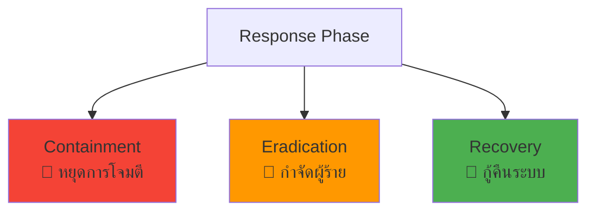

#### **1. Containment (หยุดการโจมตี)**
**เหมือนดับเพลิง** - หยุดไฟลามก่อน

**แบบเร็ว (Short-term Containment):**
- 🔌 **ถอดสายแลน** เครื่องที่ถูกโจมตี  
- 🚫 **Block IP** ของผู้โจมตี
- 🔒 **ล็อค user account** ที่น่าสงสัย
- ⏹️ **หยุด process** ที่แปลก ๆ

**แบบยั่งยืน (Long-term Containment):**
- 🛡️ เพิ่ม **Firewall rules**
- 📊 เพิ่ม **monitoring** พิเศษ
- 🔄 เปลี่ยน **รหัสผ่าน** ทั้งหมด
- 🔍 ตรวจสอบเครื่องอื่น ๆ

#### **2. Eradication (กำจัดผู้ร้าย)**  
**เหมือนทำความสะอาดบ้าน** - กวาดให้หมดจด

**สิ่งที่ต้องทำ:**
- 🦠 **ลบ malware/virus** ออกจากระบบ
- 🔧 **แก้ไขช่องโหว่** ที่แฮกเกอร์ใช้เข้ามา  
- 🆙 **อัพเดท software** ให้เป็นเวอร์ชั่นล่าสุด
- ⚙️ **เปลี่ยน configuration** ที่ไม่ปลอดภัย

**ตัวอย่าง:**
- หาก malware เข้าผ่าน email → อัพเดท email security  
- หากแฮกผ่าน RDP → ปิด RDP หรือเปลี่ยน port
- หากรหัสผ่านอ่อน → บังคับให้ใช้รหัสผ่านแข็งแรง

#### **3. Recovery (กู้คืนระบบ)**
**เหมือนซ่อมบ้านหลังไฟไหม้** - สร้างใหม่ให้ดีกว่าเดิม

**ขั้นตอนกู้คืน:**
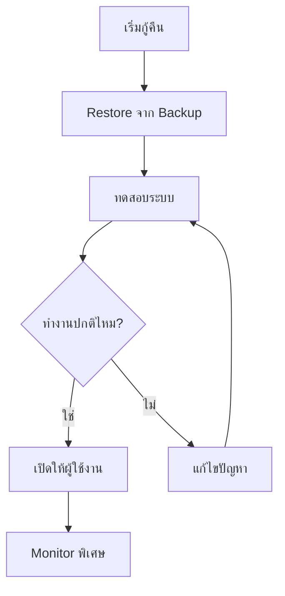

**สิ่งที่ต้องเช็ค:**
- ✅ ระบบทำงานได้ปกติ
- ✅ ข้อมูลครบถ้วน  
- ✅ ความเร็วเหมือนเดิม
- ✅ ไม่มี malware เหลืออยู่
- ✅ User login ได้

---

## Slide 10: Disaster Recovery (การกู้คืนจากภัยพิบัติ)

### 🌪️ Disaster คืออะไร?

**Disaster** = เหตุการณ์ใหญ่ที่ทำให้ระบบ IT หยุดทำงาน

**ตัวอย่าง Disaster:**
- 🔥 **ไฟไหม้** data center
- 🌊 **น้ำท่วม** ห้องเซิร์ฟเวอร์  
- ⚡ **ไฟฟ้าดับ** นานหลายวัน
- 🦠 **Ransomware** ทำลายข้อมูลหมด
- 👥 **พนักงาน IT ลาออกหมด** (Human disaster!)

### 🎯 เป้าหมายของ Disaster Recovery

#### **RTO และ RPO** (แนวคิดสำคัญ)

**RTO (Recovery Time Objective)** = เวลาที่ยอมรับได้ในการกู้คืน
**RPO (Recovery Point Objective)** = ข้อมูลที่ยอมรับให้สูญหาย

**ตัวอย่างเข้าใจง่าย:**
```
🏪 ร้านค้าออนไลน์:
- RTO = 4 ชั่วโมง (ลูกค้าไม่ซื้อของได้นานกว่านี้ไม่ได้)
- RPO = 1 ชั่วโมง (ยอมให้ order ล่าสุด 1 ชั่วโมงหายได้)

🏥 ระบบโรงพยาบาล:  
- RTO = 30 นาที (ผู้ป่วยฉุกเฉินรอไม่ได้)
- RPO = 0 นาที (ข้อมูลผู้ป่วยต้องไม่หายเลย)

🎮 เกมออนไลน์:
- RTO = 2 ชั่วโมง (เกมเมอร์รอได้บ้าง)  
- RPO = 4 ชั่วโมง (ยอมให้เซฟเกมล่าสุดหายได้)
```

### 💾 Backup Strategy: กฎ 3-2-1

**กฎ 3-2-1 = วิธีเก็บ backup ที่ปลอดภัย**

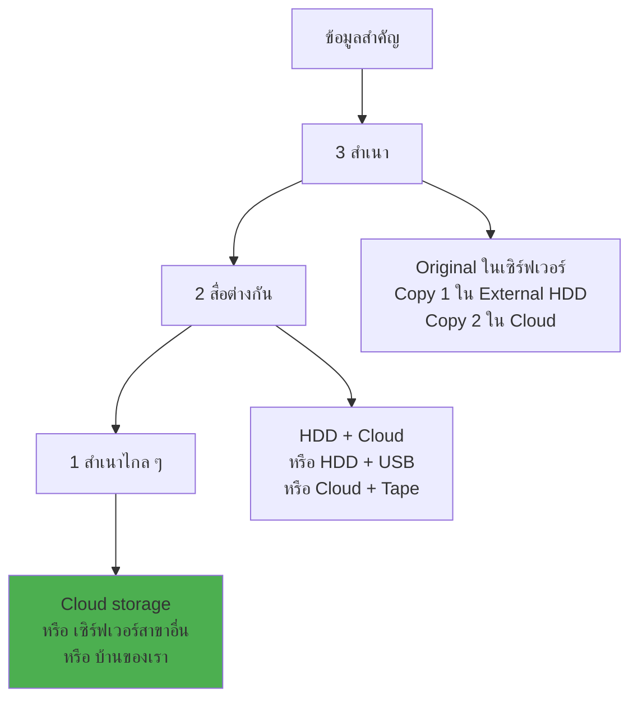

**ตัวอย่างการใช้:**
- **Copy 1**: เก็บในเครื่องเซิร์ฟเวอร์ (ใช้งานประจำ)
- **Copy 2**: เก็บใน External HDD (backup รายวัน)  
- **Copy 3**: เก็บใน Google Drive (backup รายสัปดาห์)

**ทำไมต้อง 3-2-1?**
- ไฟไหม้ → Original + External HDD หาย แต่ยังมี Cloud
- แฮกเกอร์ลบข้อมูลใน Cloud → ยังมี External HDD
- External HDD เสีย → ยังมี Original + Cloud

---

## Slide 11: Business Continuity Planning (แผนความต่อเนื่องธุรกิจ)

### 🏢 Business Continuity คืออะไร?

**Business Continuity** = การทำให้ธุรกิจยังทำงานต่อได้ แม้จะมีปัญหา

**เหมือนแผนสำรอง** เมื่อสิ่งสำคัญใช้ไม่ได้:
- รถเสีย → เรียกรถ Grab
- ไฟฟ้าดับ → เปิดเครื่องปั่นไฟ  
- คอมพิวเตอร์เสีย → ใช้คอมพิวเตอร์เครื่องอื่น
- อินเทอร์เน็ตขาด → ใช้ Internet จาก mobile

### 📊 Business Impact Analysis (BIA)

**หาว่าถ้าระบบไหนหยุด จะส่งผลกระทบแค่ไหน**

**ตัวอย่าง: บริษัทขาย Software**

| ระบบ | ถ้าหยุด 1 วัน | ถ้าหยุด 1 สัปดาห์ | ลำดับความสำคัญ |
|------|---------------|-------------------|----------------|
| **ระบบขาย** | เสียยอด 1 ล้าน | เสียยอด 10 ล้าน | 🔴 Critical |
| **ระบบ Email** | ลูกค้าโกรธเล็กน้อย | ลูกค้าไปหาคู่แข่ง | 🟡 Important |
| **ระบบ HR** | พนักงานไม่ลาได้ | พนักงานไม่ได้เงินเดือน | 🟢 Normal |
| **เว็บไซต์ข่าว** | ไม่มีใครสนใจ | ยังไม่มีใครสนใจ | ⚪ Low |

**จากตารางนี้ → จัดลำดับการกู้คืน:**
1. กู้ระบบขายก่อน (มีผลต่อรายได้)
2. กู้ระบบ Email ที่สอง (มีผลต่อลูกค้า)
3. กู้ระบบ HR ที่สาม (มีผลต่อพนักงาน)  
4. กู้เว็บไซต์ข่าวทีหลัง (ไม่ด่วน)

### 🏠 แนวทางทำงานสำรอง

#### 1. **Work from Home (WFH)**
**เมื่อ office ใช้ไม่ได้**

**สิ่งที่ต้องเตรียม:**
- 💻 Laptop สำหรับพนักงาน
- 🌐 VPN เพื่อเชื่อมต่อระบบบริษัท
- ☁️ Cloud applications (Google Workspace, Microsoft 365)
- 📞 Video conference tools (Zoom, Teams)

#### 2. **Alternative Office**
**สำหรับงานที่ต้องทำที่ office**

**ตัวอย่าง:**
- ใช้สำนักงานสาขาอื่น
- เช่า Co-working space
- ขอยืมที่ทำงานจากบริษัทเพื่อน

#### 3. **Cloud Services**
**ย้ายระบบไปอยู่ cloud ชั่วคราว**

**ประโยชน์:**
- เปิด-ปิด ได้เมื่อต้องการ
- จ่ายตามใช้จริง
- มี data center หลายแห่ง

---

## Slide 12: Crisis Management (การจัดการวิกฤต)

### 🚨 Crisis vs Incident: ต่างกันอย่างไร?

| Aspect | Incident | Crisis |
|--------|----------|---------|
| **ขนาด** | ระบบ IT เท่านั้น | ทั้งองค์กร |
| **ระยะเวลา** | ชั่วโมง-วัน | วัน-สัปดาห์ |
| **ผลกระทบ** | การทำงานชะงัก | อาจต้องปิดตัว |
| **ใครจัดการ** | ทีม IT | ผู้บริหารระดับสูง |
| **การสื่อสาร** | ภายในบริษัท | สาธารณะ/สื่อมวลชน |

**ตัวอย่าง:**
- **Incident**: เซิร์ฟเวอร์เสีย เว็บไซต์เปิดไม่ได้ 4 ชั่วโมง
- **Crisis**: ข้อมูลลูกค้า 1 ล้านคนรั่วไหล ขึ้นข่าวทีวี

### 📢 การสื่อสารในภาวะวิกฤต

#### **ใครต้องแจ้ง? แจ้งอะไร? แจ้งเมื่อไหร่?**

**1. คนในบริษัท (ภายใน 1 ชั่วโมง)**
```
เรื่อง: [URGENT] ปัญหาระบบ IT - ขอความร่วมมือ

เพื่อนพนักงานทุกท่าน

ขณะนี้เกิดปัญหาทางเทคนิคกับระบบ IT 
ทำให้ระบบขายใช้งานไม่ได้ชั่วคราว

สิ่งที่ต้องทำ:
- อย่าเปิดอีเมล์แปลก ๆ
- อย่าใช้ USB ภายนอก
- แจ้งทีม IT ทันทีหากเห็นสิ่งผิดปกติ

ทีม IT กำลังแก้ไข คาดว่าจะเสร็จภายใน 4 ชั่วโมง
```

**2. ลูกค้า (ภายใน 2 ชั่วโมง)**  
```
เรื่อง: ปรับปรุงระบบ - อาจใช้งานไม่ได้ชั่วคราว

ลูกค้าที่เคารพ

เนื่องจากการปรับปรุงระบบเพื่อความปลอดภัย
เว็บไซต์อาจใช้งานได้ไม่เสถียรในช่วง 14:00-18:00

ขออภัยในความไม่สะดวก
หากต้องการความช่วยเหลือด่วน โทร 02-xxx-xxxx

ทีมงาน ABC Company
```

**3. สื่อมวลชน (เฉพาะกรณีร้ายแรง)**
```
ข่าวประชาสัมพันธ์

บริษัท XYZ ยืนยันมาตรการรักษาความปลอดภัยข้อมูล
หลังเหตุการณ์พยายามเข้าถึงระบบโดยไม่ได้รับอนุญาต

- ไม่มีข้อมูลลูกค้ารั่วไหล
- ระบบได้รับการป้องกันตามมาตรฐานสากล  
- ทีมความปลอดภัยไซเบอร์ติดตามสถานการณ์ 24 ชั่วโมง

ติดต่อสอบถาม: คุณสมชาย โทร 08-xxxx-xxxx
```

### ⚖️ กฎหมายที่ต้องปฏิบัติ

#### **พ.ร.บ. คุ้มครองข้อมูลส่วนบุคคล (PDPA)**

**เมื่อไหร่ต้องแจ้ง:**
- มีข้อมูลส่วนบุคคลรั่วไหล
- ไม่ว่าจะ 1 คน หรือ 1 ล้านคน  
- ต้องแจ้ง **ทันที** ที่รู้

**แจ้งใคร:**
- **สำนักงาน ปปส.** ภายใน **72 ชั่วโมง**
- **เจ้าของข้อมูล** (คนที่ข้อมูลรั่วไหล) โดยเร็วที่สุด

**แจ้งอะไร:**
- เกิดอะไรขึ้น
- ข้อมูลอะไรรั่วไหล  
- กี่คน ได้รับผลกระทบ
- จะแก้ไขอย่างไร
- ช่องทางติดต่อสอบถาม

**โทษ:** ปรับได้ถึง **5,000,000 บาท**

---

## Slide 13: การปฏิบัติการจำลอง (Hands-on Exercise)

### 🎯 สถานการณ์จำลอง: บริษัท TechStart ถูกโจมตี

#### **ข้อมูลเบื้องต้น:**
- **บริษัท**: TechStart (ทำซอฟต์แวร์ HR)
- **พนักงาน**: 50 คน  
- **ลูกค้า**: 500 บริษัท (ข้อมูลพนักงาน 100,000 คน)
- **วัน-เวลา**: จันทร์ 09:30 น.

#### **เหตุการณ์:**
```
09:30 - คุณแอน (HR) โทรมาแจ้งว่า:
"คอมพิวเตอร์เปิดไฟล์ไม่ได้ค่ะ มีข้อความแปลก ๆ ขึ้นมา"

09:35 - คุณบิ๊ก (IT) เช็คแล้วพบว่า:
- ไฟล์ในเครื่องแอนกลายเป็น .locked
- มีไฟล์ README_RANSOM.txt
- เครื่องอื่น ๆ 15 เครื่อง อาการแบบเดียวกัน

09:40 - เช็คระบบสำคัญ:
- ✅ เว็บไซต์ บริษัท ยังใช้ได้
- ✅ ระบบอีเมล์ ยังใช้ได้  
- ❌ Server ฐานข้อมูลลูกค้า เชื่อมต่อช้าผิดปกติ
- ❌ ระบบ Backup ใช้งานไม่ได้
```

### 📝 แบบฝึกหัด 1: ประเมินสถานการณ์ (10 นาที)

**คำถาม:**
1. นี่คือ Incident หรือ Crisis? ทำไม?
2. ระดับความรุนแรง: เขียว/เหลือง/ส้ม/แดง?  
3. RTO และ RPO ควรเป็นเท่าไหร่?
4. ใครควรเป็นหัวหน้าทีม Incident Response?
5. ต้องแจ้งใครบ้าง? แจ้งเมื่อไหร่?

**ตัวอย่างคำตอบ:**
1. **Incident** (ยังไม่ถึงขั้น Crisis เพราะลูกค้ายังใช้งานได้)
2. **ส้ม (High)** - Ransomware + ระบบสำคัญได้รับผลกระทบ
3. **RTO: 8 ชั่วโมง, RPO: 4 ชั่วโมง** (ธุรกิจ B2B ทนได้ 1 วันทำการ)
4. **ผู้จัดการ IT** เป็นหัวหน้าทีม
5. **ทันที**: ผู้บริหาร, ทีม IT **ใน 4 ชั่วโมง**: Legal team **ใน 24 ชั่วโมง**: ลูกค้า (ถ้าข้อมูลรั่วไหล)

### 🔍 แบบฝึกหัด 2: วิเคราะห์ Log (15 นาที)

**ให้ดู Log ข้างล่าง แล้วตอบคำถาม:**

```
[2024-09-24 08:45:23] User 'maintenance' login from 203.154.xxx.xxx - SUCCESS
[2024-09-24 08:46:10] File access: /backup/customer_data.zip - User 'maintenance'  
[2024-09-24 08:47:55] Process started: encrypt.exe - User 'maintenance'
[2024-09-24 08:48:30] Multiple file writes: *.locked extension
[2024-09-24 09:15:40] Database connection timeout - Host 'db-server'
[2024-09-24 09:25:15] User 'ann.hr' login attempt FAILED - Password incorrect
[2024-09-24 09:30:44] User 'ann.hr' called IT helpdesk - "Files won't open"
```

**คำถาม:**
1. เหตุการณ์เริ่มต้นเมื่อไหร่?
2. ใครเป็นผู้ต้องสงสัย?  
3. แฮกเกอร์ทำอะไรบ้าง?
4. ทำไมคุณแอนจึง login ไม่ได้?

**คำตอบ:**
1. **08:45:23** - มีคน login ด้วย user 'maintenance' ที่ไม่ควรมี
2. **คนที่ใช้ user 'maintenance'** หรือคนที่สร้าง user นี้ขึ้นมา
3. **เข้าระบบ → เข้าถึงไฟล์ backup → รัน malware encrypt ไฟล์**
4. **รหัสผ่านถูกเปลี่ยน** โดย malware หรือแฮกเกอร์

### 📧 แบบฝึกหัด 3: เขียนข้อความแจ้ง (15 นาที)

**ให้เขียน 3 ข้อความ:**

**1. แจ้งพนักงาน (ภายใน 30 นาที)**
```
หัวข้อ: [URGENT] มาตรการรักษาความปลอดภัยฉุกเฉิน

เพื่อนพนักงานทุกท่าน

ขณะนี้เกิด______________________________
(ให้นักศึกษาเติม)

กรุณาปฏิบัติ:
- _________________________________
- _________________________________  
- _________________________________

ทีม IT
```

**2. แจ้งลูกค้า (ถ้าต้องแจ้ง)**
```
เรื่อง: ________________________________

ลูกค้าที่เคารพ

_____________________________________
_____________________________________
_____________________________________

ขออภัยในความไม่สะดวก
```

**3. แจ้งผู้บริหาร**  
```
To: CEO, CTO
เรื่อง: รายงานเหตุการณ์ด่วน - Ransomware Attack

สถานการณ์:
- ระดับความรุนแรง: _______________
- ระบบที่ได้รับผลกระทบ: ___________
- จำนวนเครื่องที่ติดเชื้อ: __________

การดำเนินการ:
1. _________________________________
2. _________________________________
3. _________________________________

คาดการณ์:
- เวลาแก้ไข: _____________________
- ความเสียหาย: __________________
```

---

## Slide 14: เครื่องมือ Incident Response พื้นฐาน

### 🛠️ เครื่องมือที่ Software Engineers ควรรู้จัก

#### **1. เครื่องมือฟรี (Open Source)**

**Log Analysis:**
- **ELK Stack** (Elasticsearch, Logstash, Kibana)
  - **ทำอะไร**: รวบรวมและวิเคราะห์ log จากหลายระบบ
  - **เหมาะกับ**: บริษัทขนาดกลาง-ใหญ่
  - **ข้อดี**: ฟรี, customize ได้เยอะ
  - **ข้อเสีย**: ตั้งค่ายาก

**Network Analysis:**  
- **Wireshark**
  - **ทำอะไร**: ดูข้อมูลที่ส่งผ่านเครือข่าย
  - **เหมาะกับ**: วิเคราะห์การโจมตีผ่าน network
  - **ข้อดี**: ใช้ง่าย, ข้อมูลละเอียด
  - **ข้อเสีย**: ข้อมูลเยอะ อาจงง

**Memory Analysis:**
- **Volatility Framework**  
  - **ทำอะไร**: วิเคราะห์ RAM ของคอมพิวเตอร์
  - **เหมาะกับ**: หา malware ที่ซ่อนใน memory
  - **ข้อดี**: หาสิ่งที่ antivirus หาไม่เจอ
  - **ข้อเสีย**: ต้องมีความรู้ระดับสูง

#### **2. เครื่องมือแบบ Cloud/SaaS**

**SIEM (Security Information and Event Management):**
- **Splunk** (มี free version 500MB/วัน)
- **Microsoft Sentinel**  
- **Google Chronicle**

**ทำอะไร**: รวบรวม log จากทุกระบบ แล้วช่วยหาแพทเทิร์นผิดปกติ

**ตัวอย่างการใช้:**
```
Input: Log จาก Web server, Database, Firewall
Output: "พบการโจมตี SQL Injection จาก IP 1.2.3.4"
```

#### **3. เครื่องมือ Incident Management**

**TheHive** - แพลตฟอร์มจัดการ incident
- **Features**: 
  - สร้าง case สำหรับแต่ละ incident
  - แบ่งงานให้ทีม
  - เก็บหลักฐาน
  - เขียน report

**MISP** - แชร์ข้อมูลภัยคุกคาม
- **ทำอะไร**: แชร์ข้อมูลผู้ร้ายกับองค์กรอื่น
- **ตัวอย่าง**: "IP 1.2.3.4 เป็นของแฮกเกอร์กลุ่ม X"

### 🔍 การใช้งานจริง

#### **ตัวอย่าง: ตรวจจับ Brute Force Attack**

**ขั้นตอน:**
1. **เก็บ log** การ login ทั้งหมด
2. **วิเคราะห์ด้วย ELK** หา pattern ผิดปกติ
3. **สร้าง alert** เมื่อมี login ผิด >20 ครั้ง ใน 5 นาที
4. **Block IP** โดยอัตโนมัติ

**Log ตัวอย่าง:**
```
2024-09-24 14:30:01 - LOGIN_FAIL - User: admin - IP: 1.2.3.4
2024-09-24 14:30:05 - LOGIN_FAIL - User: admin - IP: 1.2.3.4  
2024-09-24 14:30:09 - LOGIN_FAIL - User: root - IP: 1.2.3.4
... (อีก 50 ครั้ง)
```

**ระบบจะแจ้งเตือน:** "🚨 Possible brute force attack from 1.2.3.4"

---

## Slide 15: Phase 4 - Post-Incident Activity (หลังจากแก้ไขแล้ว)

### 📝 Lessons Learned Meeting

**ประชุมหลังแก้ไขเสร็จ** (ภายใน 1 สัปดาห์)

#### **ใครเข้าร่วม:**
- ทีม Incident Response ทั้งหมด
- ผู้บริหารที่เกี่ยวข้อง  
- ตัวแทนจากแผนกที่ได้รับผลกระทบ
- Legal team (ถ้าเกี่ยวข้องกฎหมาย)

#### **วาระการประชุม:**
```
1. ทบทวน Timeline (30 นาที)
   - เกิดอะไรขึ้น เมื่อไหร่
   - ใครทำอะไรไปแล้ว
   - ช่วงไหนที่ติดขัด

2. ประเมินการตอบสนอง (30 นาที)  
   - อะไรที่ทำได้ดี
   - อะไรที่ควรปรับปรุง
   - เครื่องมือไหนที่ใช้ได้ผล

3. Root Cause Analysis (45 นาที)
   - สาเหตุแท้จริงคืออะไร
   - ทำไมถึงเกิดขึ้นได้
   - จะป้องกันอย่างไร

4. Action Items (15 นาที)
   - ใครจะทำอะไร
   - กำหนดเวลาเสร็จ
   - วัดผลยังไง
```

### 📊 การวัดผล Incident Response

#### **KPIs สำคัญ (ตัวชี้วัด)**

**1. Response Time Metrics**
```
📏 MTTD (Mean Time to Detect) 
= เวลาเฉลี่ยในการตรวจจับ
เป้าหมาย: < 4 ชั่วโมง

📏 MTTC (Mean Time to Contain)  
= เวลาเฉลี่ยในการหยุดการโจมตี
เป้าหมาย: < 2 ชั่วโมง

📏 MTTR (Mean Time to Recovery)
= เวลาเฉลี่ยในการกู้คืนระบบ
เป้าหมาย: < 8 ชั่วโมง
```

**ตัวอย่างการคำนวณ:**
```
Incident A: Detect 2h, Contain 1h, Recover 6h
Incident B: Detect 6h, Contain 3h, Recover 12h  
Incident C: Detect 1h, Contain 0.5h, Recover 4h

MTTD = (2+6+1)/3 = 3 ชั่วโมง ✅ (เป้าหมาย <4h)
MTTC = (1+3+0.5)/3 = 1.5 ชั่วโมง ✅ (เป้าหมาย <2h)  
MTTR = (6+12+4)/3 = 7.3 ชั่วโมง ✅ (เป้าหมาย <8h)
```

**2. Business Impact Metrics**
- 💰 **ค่าเสียหาย** (Revenue Loss)
- 👥 **จำนวนผู้ใช้ที่ได้รับผลกระทบ** 
- ⏰ **ระยะเวลาที่หยุดให้บริการ** (Downtime)
- 😤 **จำนวนคำร้องเรียน** จากลูกค้า

### 📈 การปรับปรุงระบบ

#### **ตัวอย่าง Action Items หลัง Incident:**

**จากกรณี Ransomware ที่ TechStart:**

| ปัญหาที่พบ | การแก้ไข | ผู้รับผิดชอบ | กำหนดเสร็จ |
|------------|----------|-------------|------------|
| Backup system ใช้ไม่ได้ | ซื้อ backup solution ใหม่ | IT Manager | 30 วัน |
| ไม่มี user 'maintenance' ที่ถูกต้อง | Audit user accounts ทั้งหมด | System Admin | 7 วัน |
| Log ไม่ครบถ้วน | เพิ่ม logging ในระบบสำคัญ | Software Engineer | 14 วัน |
| พนักงานไม่รู้ว่าต้องทำอะไร | จัดฝึกอบรม Security Awareness | HR + IT | 21 วัน |

---

## Slide 16: การเตรียมความพร้อมองค์กร

### 🏢 Incident Response Maturity Levels

**ระดับความเป็นผู้ใหญ่** ของการจัดการ incident ในองค์กร

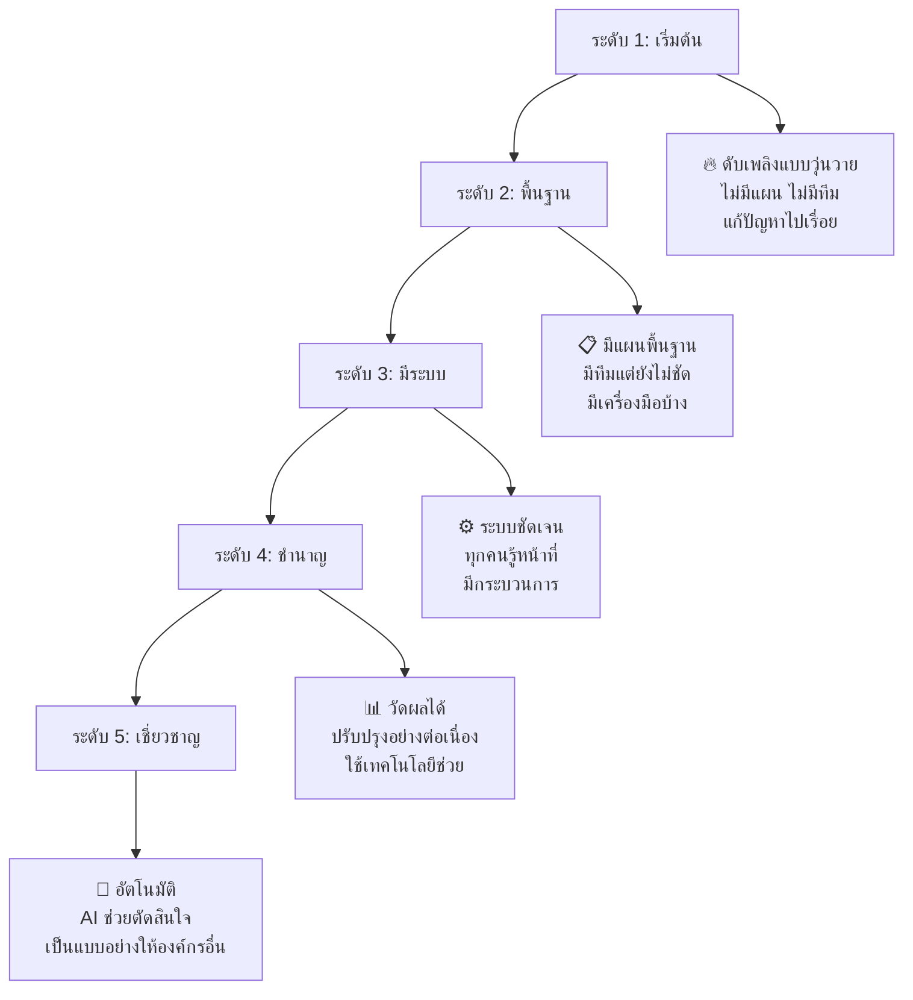

#### **ประเมินองค์กรของคุณ:**

**Checklist การประเมิน:**
```
ระดับ 1 (เริ่มต้น):
☐ ไม่มีแผน Incident Response เป็นลายลักษณ์อักษร
☐ ไม่รู้ว่าใครจะทำอะไรเมื่อเกิดเหตุ  
☐ ไม่มี backup หรือ backup ไม่สมบูรณ์
☐ พนักงานไม่รู้จักภัยคุกคามพื้นฐาน

ระดับ 2 (พื้นฐาน):
☐ มีแผน IR เขียนไว้แต่ไม่ได้ทดสอบ
☐ มีคนรับผิดชอบแต่ยังไม่ชัดเจน
☐ มี backup แต่ไม่ได้ test การ restore
☐ มีอบรม security เป็นครั้งคราว

ระดับ 3 (มีระบบ):
☐ มีแผน IR ที่ชัดเจน และมีการทดสอบ
☐ ทีม IR มีบทบาทหน้าที่ชัดเจน
☐ มีเครื่องมือ monitoring และ alerting  
☐ มีการอบรมพนักงานเป็นประจำ

ระดับ 4-5: (ชำนาญ-เชี่ยวชาญ)
☐ ใช้ AI/ML ช่วยตรวจจับภัยคุกคาม
☐ มีการแชร์ข้อมูลกับองค์กรภายนอก
☐ สามารถตอบสนองอัตโนมัติได้บางส่วน
☐ เป็นที่ปรึกษาให้องค์กรอื่น
```

### 🎯 การวางแผนพัฒนา

#### **สำหรับองค์กรระดับ 1-2 (ขั้นเริ่มต้น):**

**ปี 1: สร้างพื้นฐาน**
1. **เดือน 1-3**: เขียนแผน Incident Response Plan
2. **เดือน 4-6**: จัดตั้งทีม IR และกำหนดบทบาท
3. **เดือน 7-9**: ติดตั้งเครื่องมือ monitoring พื้นฐาน  
4. **เดือน 10-12**: อบรมพนักงาน จัด tabletop exercise

**ปี 2: พัฒนาความสามารถ**
1. **Q1**: จัด simulation exercise ครั้งแรก
2. **Q2**: ปรับปรุงแผนตามผลการทดสอบ
3. **Q3**: เพิ่มเครื่องมืออัตโนมัติ  
4. **Q4**: วัดผล KPIs และวางแผนปีถัดไป

#### **งบประมาณคร่าว ๆ สำหรับ SME (50-200 คน):**

| รายการ | ค่าใช้จ่าย/ปี | หมายเหตุ |
|--------|-------------|----------|
| **SIEM Software** | 500K-2M บาท | Splunk หรือ Microsoft Sentinel |
| **Backup Solution** | 200K-500K บาท | Cloud backup + local |
| **Security Training** | 100K-300K บาท | อบรมพนักงาน + certification |
| **Consultant** | 500K-1M บาท | ช่วยออกแบบและติดตั้ง |
| **Hardware** | 200K-500K บาท | Server, storage สำหรับ SIEM |
| **รวม** | **1.5M-4.3M บาท** | ขึ้นกับขนาดองค์กร |

**ROI (ผลตอบแทน):**
- **ไม่มีระบบ**: เสียหาย 10-50M บาท เมื่อเกิด major incident
- **มีระบบ**: ลดความเสียหายเหลือ 2-10M บาท
- **คุ้มค่า**: ภายใน 2-3 ปี

---

## Slide 17: ความท้าทายในยุคปัจจุบัน

### 🌐 ภัยคุกคามใหม่ ๆ

#### **1. Cloud Security Challenges**

**ปัญหาเฉพาะ Cloud:**
- **Shared Responsibility Model**: ใครรับผิดชอบอะไร?
- **Multi-tenant Environment**: ข้อมูลเราปลอดภัยจากคนอื่นไหม?
- **Configuration Mistakes**: ตั้งค่าผิด → ข้อมูลรั่วไหล

**ตัวอย่างเหตุการณ์จริง:**
- **Capital One (2019)**: แฮกเกอร์ exploit misconfigured AWS WAF
- **ได้ข้อมูล**: 100 ล้านคน ในอเมริกา
- **สาเหตุ**: IAM role ที่มีสิทธิ์มากเกินไป

**การป้องกัน:**
```
☁️ Cloud Security Checklist:
☐ ใช้ Multi-Factor Authentication (MFA) ทุก account
☐ ตั้งค่า IAM ตามหลัก Least Privilege  
☐ เปิด CloudTrail/Audit Logging ทุก service
☐ ใช้ AWS Config/Azure Policy เช็คการตั้งค่า
☐ Encrypt data ทั้ง at-rest และ in-transit
```

#### **2. Remote Work Security**

**ปัญหาการทำงานจากบ้าน:**
- **Home Network**: ไม่มี corporate firewall
- **Personal Devices**: ใช้เครื่องส่วนตัวทำงาน
- **Public WiFi**: ทำงานในร้านกาแฟ
- **Family Members**: ลูกเล่นคอมพิวเตอร์ทำงาน

**มาตรการป้องกัน:**
```
🏠 WFH Security Checklist:
☐ บังคับใช้ VPN เมื่อเชื่อมต่อระบบบริษัท
☐ ติดตั้ง EDR/Antivirus ในเครื่องทุกเครื่อง
☐ ใช้ MDM จัดการ mobile devices
☐ อบรมเรื่อง phishing และ social engineering  
☐ ใช้ Zero Trust Network Architecture
```

#### **3. Supply Chain Attacks**

**การโจมตีผ่าน software ที่เราใช้:**
- **SolarWinds (2020)**: malware แฝงใน software update
- **Log4j (2021)**: vulnerability ใน Java library ยอดนิยม
- **Codecov (2021)**: แฮก CI/CD pipeline

**ป้องกันอย่างไร:**
```
🔗 Supply Chain Security:
☐ Inventory ทุก software และ dependency
☐ ใช้ Software Composition Analysis (SCA) tools
☐ ติดตาม security advisories ของ vendors
☐ มี rollback plan สำหรับ software updates
☐ ใช้ code signing และ verification
```

### 🤖 AI และการจัดการ Incident

#### **AI ช่วยได้อย่างไร:**

**1. Automated Detection**
- วิเคราะห์ log patterns แบบ real-time
- หา anomaly ที่คนพลาดได้
- ลด false positive alerts

**2. Incident Classification**  
- จำแนกประเภท incident อัตโนมัติ
- ประเมินความรุนแรง
- แนะนำขั้นตอนการแก้ไข

**3. Response Automation**
- Block malicious IPs อัตโนมัติ
- Isolate infected machines
- Create incident tickets

#### **ข้อจำกัดของ AI:**
- **False Positives**: ยังคิดผิดได้
- **Black Box**: ไม่รู้ว่าทำไมตัดสินใจแบบนั้น  
- **Adversarial Attacks**: แฮกเกอร์หลอก AI ได้
- **Cost**: ค่าใช้จ่ายสูง

---

## Slide 18: การเตรียมตัวสู่อาชีพ

### 💼 เส้นทางอาชีพด้าน Cybersecurity

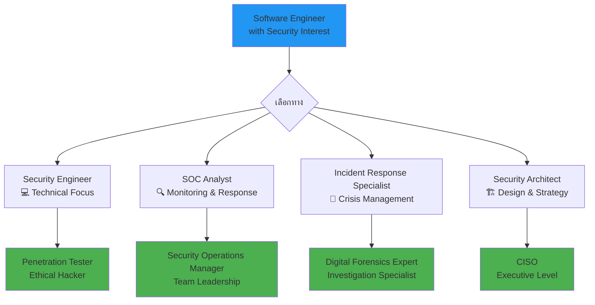

#### **ตำแหน่งงานและเงินเดือน (ประมาณการ 2024):**

| ตำแหน่ง | เงินเดือนเริ่มต้น | เงินเดือน 5 ปี | ความรับผิดชอบหลัก |
|---------|-----------------|----------------|------------------|
| **SOC Analyst** | 25K-35K | 50K-70K | Monitor security events 24/7 |
| **Incident Response** | 40K-60K | 80K-120K | Handle security incidents |  
| **Security Engineer** | 50K-80K | 100K-150K | Build secure systems |
| **Digital Forensics** | 60K-90K | 120K-180K | Investigate cyber crimes |
| **Security Architect** | 80K-120K | 150K-250K | Design security strategy |

### 📚 Skills ที่ต้องพัฒนา

#### **Technical Skills (ทักษะเทคนิค):**

**Level 1: พื้นฐาน (ปี 3-4)**
- 🐧 **Linux Command Line**: จัดการ server, วิเคราะห์ log
- 🌐 **Network Fundamentals**: TCP/IP, DNS, HTTP/HTTPS  
- 🔍 **Log Analysis**: อ่าน log ไฟล์ หา pattern ผิดปกติ
- 🐍 **Scripting**: Python, Bash สำหรับ automation

**Level 2: ระดับกลาง (1-3 ปีประสบการณ์)**
- 🛡️ **SIEM Platforms**: Splunk, ELK, Microsoft Sentinel
- 🔬 **Digital Forensics**: Volatility, Autopsy, Wireshark  
- ☁️ **Cloud Security**: AWS/Azure/GCP security services
- 🔐 **Cryptography**: เข้าใจการเข้ารหัสพื้นฐาน

**Level 3: ระดับสูง (3+ ปีประสบการณ์)**
- 🤖 **Security Orchestration**: SOAR platforms
- 🧠 **Threat Intelligence**: MISP, threat hunting
- 🏗️ **Security Architecture**: Zero Trust, defense in depth
- 👥 **Team Leadership**: จัดการทีม, วางแผนกลยุทธ์

#### **Soft Skills (ทักษะชีวิต):**

- 📝 **Communication**: เขียนรายงาน, อธิบายเทคนิคให้คนไม่ใช่ IT เข้าใจ
- ⚡ **Stress Management**: ทำงานภายใต้ความกดดัน  
- 🎯 **Critical Thinking**: วิเคราะห์ปัญหาอย่างเป็นระบบ
- 🔄 **Continuous Learning**: เรียนรู้เทคโนโลยีใหม่ตลอด
- 👥 **Teamwork**: ทำงานร่วมกับหลายแผนก

### 🏆 Certifications ที่คุ้มค่า

#### **Entry Level (นักศึกษา - Fresh Graduate):**
- **CompTIA Security+**: พื้นฐาน cybersecurity รอบด้าน
- **CompTIA Network+**: เข้าใจ network fundamentals  
- **Google Cybersecurity Certificate**: practical skills

#### **Professional Level (1-5 ปีประสบการณ์):**
- **GCIH** (GIAC Certified Incident Handler): เฉพาะทาง incident response
- **CISSP** (Certified Information Systems Security Professional): รอบด้าน
- **CEH** (Certified Ethical Hacker): มุมมองของผู้โจมตี

#### **Expert Level (5+ ปีประสบการณ์):**
- **OSCP** (Offensive Security Certified Professional): penetration testing
- **CISM** (Certified Information Security Manager): leadership
- **CISSP** เฉพาะสาขา: CISSP-ISSAP, CISSP-ISSEP

---

## Slide 19: แหล่งเรียนรู้และฝึกหัด

### 📖 แหล่งความรู้ฟรี

#### **1. Online Learning Platforms:**

**Coursera:**
- **IBM Cybersecurity Analyst** (Professional Certificate)
- **Google Cybersecurity** (Professional Certificate)  
- **University courses** จากมหาวิทยาลัยดัง

**YouTube Channels ที่แนะนำ:**
- **Professor Messer** (CompTIA Security+)
- **Cybrary** (Various cybersecurity topics)
- **SANS Institute** (Professional-grade training)
- **John Hammond** (Practical cybersecurity)

**Podcasts:**
- **Darknet Diaries** (เล่าเหตุการณ์โจมตีจริง)
- **Security Now** (ข่าวและเทคนิคล่าสุด)
- **CyberWire Daily** (ข่าวรายวัน)

#### **2. Hands-on Practice:**

**Blue Team Labs:**
- **CyberDefenders** (Blue team challenges)
- **SANS Holiday Hack Challenge** (ประจำปี ฟรี)
- **TryHackMe** (Blue team path)
- **HackTheBox** (Defensive security tracks)

**Capture The Flag (CTF):**
- **PicoCTF** (เหมาะกับมือใหม่)
- **OverTheWire** (Linux command line)
- **ROOT-ME** (Web security challenges)

### 🏛️ แหล่งข้อมูลจากภาครัฐ

#### **ประเทศไทย:**
- **ThaiCERT** (www.thaicert.or.th)
  - รายงานภัยคุกคาม
  - แนวทางปฏิบัติ  
  - ข่าวสารด้าน cybersecurity

- **ETDA** (www.etda.or.th)  
  - กฎหมาย พ.ร.บ. คุ้มครองข้อมูลส่วนบุคคล
  - แนวทางการปฏิบัติ

- **สำนักงาน ปปส.**
  - แนวทางการแจ้ง data breach
  - Case studies การลงโทษ

#### **สากล:**
- **NIST Cybersecurity Framework** (www.nist.gov)
- **OWASP** (owasp.org) - Web application security  
- **SANS Institute** (www.sans.org) - Training และ research
- **MITRE ATT&CK** (attack.mitre.org) - Threat intelligence

### 👥 Communities และ Networking

#### **กลุ่มใน Facebook:**
- **Cyber Security Thailand**
- **Thailand InfoSec Community**  
- **Bug Bounty Thailand**
- **DevSecOps Thailand**

#### **Events และ Conferences:**
- **InfoSec Thailand** (ประจำปี)
- **Thailand Cyber Top Talk**
- **OWASP Bangkok Chapter** meetings
- **BSides Bangkok** (community conference)

#### **Local User Groups:**
- **Bangkok 2600** (Hacker meetup)
- **DEFCON Bangkok** (Security community)
- **null Bangkok** (Open security community)

---

## Slide 20: สรุปและขั้นตอนต่อไป

### 🎯 สรุปสิ่งที่เรียนมาวันนี้

#### **4 หัวข้อสำคัญ:**

**1. Incident Response Process** 
- **NIST 4 ขั้นตอน**: Preparation → Detection → Response → Recovery
- **เหมือนการดับเพลิง**: เตรียมพร้อม → เห็นไฟ → ดับ → ซ่อมบ้าน
- **สำคัญที่สุด**: การเตรียมพร้อมล่วงหน้า

**2. Computer Forensics พื้นฐาน**
- **6 ขั้นตอน**: Identify → Preserve → Collect → Examine → Analyze → Report  
- **Chain of Custody**: เก็บหลักฐานให้ใช้ในศาลได้
- **เครื่องมือพื้นฐาน**: Volatility, Wireshark, Log analysis

**3. Disaster Recovery & Business Continuity**
- **RTO/RPO**: กำหนดเวลาและข้อมูลที่ยอมรับให้เสีย  
- **3-2-1 Backup Rule**: 3 สำเนา, 2 สื่อ, 1 ไกล ๆ
- **BCP Planning**: วางแผนให้ธุรกิจทำงานต่อได้

**4. Crisis Management**  
- **การสื่อสาร**: ใครแจ้งใคร เมื่อไหร่ อย่างไร
- **กฎหมาย PDPA**: แจ้ง สำนักงาน ปปส. ภายใน 72 ชั่วโมง
- **การจัดการผู้มีส่วนได้ส่วนเสีย**

### 🚀 Action Items สำหรับนักศึกษา

#### **ระยะสั้น (1 เดือนข้างหน้า):**

**สัปดาห์ที่ 1-2:**
- 📖 **อ่านเพิ่มเติม**: NIST Cybersecurity Framework (แบบย่อ)
- 🎥 **ดู YouTube**: Professor Messer CompTIA Security+ ไป 5 วิดีโอ
- 📝 **ลองทำ**: Personal Incident Response Plan (ตามแบบฝึกหัดที่แจก)

**สัปดาห์ที่ 3-4:**  
- 🔧 **ลองใช้เครื่องมือ**: ติดตั้ง Wireshark แล้วดูการเข้าเว็บไซต์
- 💻 **ฝึก Linux**: ใช้ command line ดู log ไฟล์
- 👥 **Join กลุ่ม**: เข้ากลุ่ม Cyber Security Thailand ใน Facebook

#### **ระยะกลาง (3-6 เดือน):**
- 🏆 **เตรียมสอบ**: CompTIA Security+ (มี voucher ลดราคาให้นักเรียน)
- 🎮 **เล่น CTF**: ลงทะเบียน PicoCTF หรือ TryHackMe  
- 📊 **โครงงาน**: เพิ่มฟีเจอร์ security ในโปรเจคปีปจุบัน
- 🗣️ **เข้าร่วมงาน**: ไปงาน InfoSec Thailand หรือ meetup

#### **ระยะยาว (1 ปี):**
- 💼 **หา Internship**: ใน SOC, Security team, หรือ consulting
- 📜 **เก็บ Certification**: อย่างน้อย 1 ใบ (Security+ หรือ Google Cyber)
- 👨‍💼 **Network**: รู้จักคนในวงการ ผ่าน LinkedIn, events
- 🎓 **วางแผนอาชีพ**: เลือกว่าอยากไปทางไหน (SOC, IR, Architecture)

### 📝 Assignment ประจำสัปดาห์

#### **โครงงาน: Personal Incident Response Plan**

**เป้าหมาย**: สร้างแผนรับมือเหตุการณ์สำหรับตัวเอง

**ขั้นตอนการทำ:**

**1. Asset Inventory** (สร้างรายการทรัพย์สิน)
```
📱 อุปกรณ์ของฉัน:
- Laptop: MacBook Pro 2021  
- Phone: iPhone 13
- External HDD: 1TB สำหรับ backup
- Cloud Storage: Google Drive 100GB

💾 ข้อมูลสำคัญ:  
- รูปภาพครอบครัว (Google Photos)
- โปรเจคมหาวิทยาลัย (GitHub + local)
- เอกสารสำคัญ (Google Drive)
- รหัสผ่านต่าง ๆ (Password manager)
```

**2. Risk Assessment** (ประเมินความเสี่ยง)
```
🚨 สิ่งที่กลัวที่สุด:
1. Laptop ถูกขโมย/เสีย → เสียโปรเจค 4 เดือน
2. iPhone หาย → เสียรูปภาพ + ไม่ได้ 2FA codes  
3. Google Account ถูกแฮก → เสียทุกอย่าง
4. Ransomware → ไฟล์ทั้งหมดเข้ารหัส
```

**3. Response Plan** (แผนรับมือ)
```
📋 เมื่อ Laptop หาย/เสีย:
Step 1: เปลี่ยนรหัสผ่านทุก account ที่ auto-login
Step 2: Report ให้ Apple/Microsoft ล็อค device  
Step 3: ใช้ backup จาก External HDD + Google Drive
Step 4: ซื้อเครื่องใหม่และ restore ข้อมูล
Step 5: Review security settings ใหม่

📋 เมื่อ Google Account ถูกแฮก:
Step 1: เข้า account recovery ทันที
Step 2: เปลี่ยนรหัสผ่าน + เปิด 2FA
Step 3: ดู activity log หาสิ่งผิดปกติ
Step 4: เช็คว่ามีข้อมูลถูกลบหรือส่งออกไหม
Step 5: แจ้งคนใกล้ชิดถ้ามีอีเมล์แปลก ๆ จากเรา
```

**4. Prevention Measures** (มาตรการป้องกัน)
```
🛡️ สิ่งที่จะทำเพื่อป้องกัน:
☐ ใช้ Password Manager (1Password, Bitwarden)
☐ เปิด 2FA ทุก account สำคัญ  
☐ Backup อัตโนมัติ 1 สัปดาห์/ครั้ง
☐ เข้ารหัส External HDD ด้วย BitLocker/FileVault
☐ ไม่เปิดอีเมล์แปลก ๆ หรือลิงก์น่าสงสัย
☐ Update OS และแอปเป็นประจำ
```

**5. Contact List** (รายชื่อติดต่อฉุกเฉิน)
```
📞 คนที่จะติดต่อเมื่อเกิดเหตุ:
- พ่อแม่: 08-xxxx-xxxx
- เพื่อนสนิท (เก่งคอม): 06-xxxx-xxxx  
- อาจารย์ที่ปรึกษา: advisor@university.ac.th
- IT Support มหาลัย: 02-xxx-xxxx

🏢 หน่วยงานภายนอก:
- ตำรวจไซเบอร์: 1441  
- ThaiCERT: cert@thaicert.or.th
- Apple Support: 1800-xxxx-xxxx
```

**การส่งงาน:**
- 📄 **เอกสาร**: 2-3 หน้า (PDF)
- 💻 **GitHub**: อัพโหลด template ที่ทำเป็น Markdown
- 🎥 **วิดีโอ**: อธิบาย 3-5 นาที วิธีใช้ plan ที่สร้าง
- **กำหนดส่ง**: 2 สัปดาห์

**เกณฑ์การให้คะแนน:**
- **ความครบถ้วน** (40%): ครอบคลุมทุกหัวข้อที่กำหนด
- **ความเป็นจริง** (30%): applicable กับสถานการณ์จริงของตัวเอง  
- **ความชัดเจน** (20%): เขียนเข้าใจง่าย มีขั้นตอนชัดเจน
- **ความคิดสร้างสรรค์** (10%): มีแนวคิดเพิ่มเติมที่น่าสนใจ

---

## Slide 21: เกมส์ทบทวน - Incident Response Quiz

### 🎮 มินิเกมส์: "ช่วยบริษัท ABC จากวิกฤต!"

#### **รอบที่ 1: ระบุประเภท Incident**

**สถานการณ์ที่ 1:**
> มีคนโทรมาแจ้งว่าเป็น "คนจาก Microsoft" บอกว่าคอมพิวเตอร์เรามีไวรัส ขอ remote access เพื่อช่วยแก้ไข

**คำถาม:** นี่คือ incident ประเภทไหน? ระดับความรุนแรงเท่าไหร่?
**ตัวเลือก:**  
A) Malware infection - ระดับสูง  
B) Social engineering - ระดับกลาง  
C) Phishing - ระดับต่ำ  
D) Insider threat - ระดับวิกฤต

<details>
<summary><b>คำตอบ</b></summary>
<b>B) Social engineering - ระดับกลาง</b><br>
นี่คือการหลอกแบบ vishing (voice phishing) ถ้าหลงเชื่อจะให้ access เข้าระบบ
</details>

**สถานการณ์ที่ 2:**
> พบว่าไฟล์ในเซิร์ฟเวอร์ database มีการเปลี่ยนแปลง รหัสผ่าน admin ถูกเปลี่ยน และมี user account ใหม่ชื่อ "system_backup"

**คำถาม:** Action แรกที่ควรทำคือ?
**ตัวเลือก:**
A) เปลี่ยนรหัสผ่าน admin กลับ  
B) ลบ user account "system_backup"
C) Disconnect เซิร์ฟเวอร์จากเครือข่าย
D) รีสตาร์ทเซิร์ฟเวอร์

<details>
<summary><b>คำตอบ</b></summary>
<b>C) Disconnect เซิร์ฟเวอร์จากเครือข่าย</b><br>
ต้อง contain ก่อน เพื่อหยุดการโจมตีและเก็บหลักฐาน ห้ามรีสตาร์ทเพราะจะเสีย evidence ใน memory
</details>

#### **รอบที่ 2: Timeline Analysis**

**ให้ดู log ข้างล่าง แล้วเรียงลำดับเหตุการณ์:**
```
[14:35] User 'backup_admin' created by 'system'
[14:20] SSH login from 203.xxx.xxx.xxx - user 'admin'  
[14:30] Password changed for user 'admin'
[14:25] Multiple files downloaded from /database/customer/
[14:40] New cronjob created: */5 * * * * /tmp/backdoor.sh
[14:15] Failed login attempts x50 for user 'admin' from 203.xxx.xxx.xxx
```

**คำถาม:** เรียงลำดับเวลาที่ถูกต้อง และอธิบายว่าแฮกเกอร์ทำอะไรบ้าง

<details>
<summary><b>คำตอบ</b></summary>
<b>Timeline:</b><br>
14:15 - Brute force attack ลุ้นรหัสผ่าน admin<br>
14:20 - Login สำเร็จ<br>
14:25 - Download ข้อมูลลูกค้า<br>
14:30 - เปลี่ยนรหัสผ่าน admin<br>
14:35 - สร้าง backdoor user<br>
14:40 - ติดตั้ง persistent backdoor<br>
<b>สรุป:</b> แฮกเกอร์ brute force เข้าระบบ → ขโมยข้อมูล → สร้างช่องทางลับเพื่อกลับเข้ามาใหม่
</details>

#### **รอบที่ 3: Communication Challenge**

**สถานการณ์:** บริษัทผลิตแอป fitness ถูกโจมตี ransomware 
- ข้อมูล health data ของ 10,000 users ถูกเข้ารหัส
- Backup ระบบหลักใช้ไม่ได้ 
- คาดว่าจะแก้ไขได้ใน 3 วัน
- ขณะนี้เป็นเวลา 10:00 น. วันศุกร์

**คำถาม:** จัดลำดับการแจ้งข่าว (1=แจ้งก่อน, 5=แจ้งหลัง)

☐ แจ้งพนักงานทั้งหมด  
☐ แจ้งผู้ใช้แอป  
☐ แจ้งสำนักงาน ปปส.  
☐ แจ้ง CEO/ผู้ถือหุ้น  
☐ แจ้งสื่อมวลชน

<details>
<summary><b>คำตอบ</b></summary>
<b>ลำดับที่ถูกต้อง:</b><br>
1. แจ้ง CEO/ผู้ถือหุ้น (ทันที - เพื่อตัดสินใจ)<br>
2. แจ้งพนักงานทั้งหมด (ใน 1 ชั่วโมง - ป้องกันการรั่วไหล)<br>
3. แจ้งสำนักงาน ปปส. (ภายใน 72 ชั่วโมง - ตามกฎหมาย)<br>
4. แจ้งผู้ใช้แอป (ภายใน 24 ชั่วโมง - มี health data เกี่ยวข้อง)<br>
5. แจ้งสื่อมวลชน (ถ้าจำเป็น - หลังเตรียม statement ดี ๆ)
</details>

### 🏆 คะแนนและรางวัล

**คะแนนเต็ม 15 คะแนน:**
- รอบที่ 1: 6 คะแนน (3 คะแนน/ข้อ)
- รอบที่ 2: 5 คะแนน  
- รอบที่ 3: 4 คะแนน

**เกรด:**
- **13-15 คะแนน**: 🥇 Expert Level - พร้อมเป็น Incident Commander!
- **10-12 คะแนน**: 🥈 Advanced Level - ได้เป็น Deputy ได้แล้ว
- **7-9 คะแนน**: 🥉 Intermediate Level - ต้องฝึกเพิ่ม  
- **0-6 คะแนน**: 📚 Beginner Level - กลับไปทบทวนครับ

---

## Slide 22: ขยายความรู้ - Emerging Trends

### 🚀 เทรนด์ใหม่ที่ควรจับตา

#### **1. Zero Trust Security Model**

**แนวคิดเดิม**: "Trust but Verify"
- คนในบริษัท = เชื่อถือได้
- เครือข่ายภายใน = ปลอดภัย
- มี perimeter security (firewall) = ป้องกันได้

**แนวคิดใหม่**: "Never Trust, Always Verify"  
- **ไม่เชื่อถือใครเลย** แม้แต่คนในบริษัท
- **ตรวจสอบทุกครั้ง** ที่มีการเข้าถึงข้อมูล
- **Least Privilege** - ให้สิทธิ์น้อยที่สุดที่จำเป็น

**ตัวอย่างการใช้งาน:**
```
🔐 เดิม: เข้า VPN แล้ว → เข้าได้ทุกระบบในบริษัท

🔐 Zero Trust: 
เข้า VPN → ยืนยันตัวตน → ขออนุญาตเข้า System A 
→ ตรวจสอบ device ปลอดภัยไหม → ใช้งานได้แค่ System A เท่านั้น
→ ต้องขออนุญาตใหม่ทุกครั้งที่เปลี่ยน system
```

#### **2. AI-Powered Security Operations**

**ปัญหาของ SOC ปัจจุบัน:**
- Alert มากเกินไป (Alert fatigue)  
- ขาดแคลน Security Analysts  
- ใช้เวลาวิเคราะห์นาน

**AI ช่วยได้อย่างไร:**
- **Automated Triage**: จำแนก alert ว่าอันไหนสำคัญ
- **Pattern Recognition**: หาความผิดปกติที่คนพลาด  
- **Predictive Analysis**: ทำนายว่าจะถูกโจมตีแบบไหน
- **Automated Response**: ตอบสนองได้ใน milliseconds

**ตัวอย่าง:**
```
🤖 AI System ตรวจพบ:
"User john.doe เข้าถึงไฟล์ 500 ไฟล์ ใน 5 นาที 
เมื่อปกติเข้าแค่ 10 ไฟล์/ชั่วโมง 
และ login จาก location ที่ไม่เคยเห็น"

→ AI ประเมิน: ความเสี่ยงสูง 85%
→ Action อัตโนมัติ: Lock account, Alert security team
→ Human analyst: ตัดสินใจขั้นต่อไป
```

#### **3. Cloud-Native Security**

**การเปลี่ยนแปลง:**
- ระบบย้ายไป **cloud มากขึ้น**  
- ใช้ **containers และ microservices**
- **DevOps culture** - deploy บ่อยขึ้น

**Security challenges ใหม่:**
- **Shared responsibility model**: ใครรับผิดชอบอะไร?
- **Dynamic infrastructure**: server เปิด-ปิด อัตโนมัติ  
- **Multi-cloud complexity**: ใช้ AWS + Azure + GCP พร้อมกัน

**เครื่องมือใหม่ที่ต้องรู้จัก:**
- **CSPM** (Cloud Security Posture Management)  
- **CWP** (Cloud Workload Protection)
- **CASB** (Cloud Access Security Broker)

#### **4. Extended Detection and Response (XDR)**

**ปัญหาของเครื่องมือแยก ๆ:**
- **EDR** ดูแค่ endpoint (laptop, server)
- **NDR** ดูแค่ network traffic  
- **SIEM** รวม log แต่ไม่ได้วิเคราะห์ลึก

**XDR คืออะไร:**  
- รวมข้อมูลจาก **ทุก layer** (endpoint, network, cloud, email)
- ใช้ **AI วิเคราะห์** หา attack chain ที่สมบูรณ์
- **Automated response** ข้าม platform

**ประโยชน์:**
```
💡 ตัวอย่าง attack chain ที่ XDR หาได้:
1. Phishing email → user เปิดแล้วติด malware  
2. Malware ทำ lateral movement ผ่าน network
3. ขโมยข้อมูลส่งไป cloud storage แปลก ๆ

เครื่องมือเดิม: เห็นแค่ชิ้นส่วน ไม่เห็นภาพรวม
XDR: เห็นทั้ง attack chain เชื่อม timeline ได้
```

### 🔮 การเตรียมตัวสำหรับอนาคต

#### **Skills ที่จะสำคัญใน 5 ปี:**
- **Cloud Architecture**: AWS/Azure/GCP certified  
- **AI/ML Fundamentals**: เข้าใจพื้นฐาน machine learning
- **DevSecOps**: รวม security เข้า CI/CD pipeline
- **Automation**: Python/Go สำหรับ security automation  
- **Privacy Engineering**: GDPR, PDPA compliance by design

#### **Mindset ที่ต้องปรับ:**
- จาก **Reactive** → **Proactive** (ป้องกันแทนแก้ไข)
- จาก **Tool-focused** → **Process-focused** (กระบวนการสำคัญกว่าเครื่องมือ)
- จาก **Siloed** → **Collaborative** (ทำงานข้าม function)
- จาก **Compliance-driven** → **Risk-driven** (มุ่งเน้นลดความเสี่ยง)

---

## Slide 23: กรณีศึกษาจากประเทศไทย

### 🇹🇭 เหตุการณ์ที่เกิดขึ้นจริงในไทย

#### **กรณี 1: การโจมตีระบบโรงพยาบาล (2022)**

**สถานการณ์:**
- โรงพยาบาลเอกชนขนาดใหญ่ถูก ransomware
- ระบบ HIS (Hospital Information System) ใช้ไม่ได้
- ข้อมูลผู้ป่วย 200,000 ราย ถูกเข้ารหัส
- แฮกเกอร์เรียกค่าไถ่ 50 ล้านบาท

**Timeline:**
```
วันเสาร์ 02:30 - แฮกเกอร์เข้าระบบผ่าน RDP ที่มีรหัสผ่านอ่อน
วันเสาร์ 03:00 - เริ่มเข้ารหัสไฟล์จาก file server  
วันเสาร์ 08:00 - พยาบาลพบว่าระบบใช้ไม่ได้ เมื่อมาทำงาน
วันเสาร์ 09:00 - IT team มาดูและพบ ransom note
วันเสาร์ 10:00 - แจ้งผู้บริหาร ประกาศ "ปรับปรุงระบบ"
วันจันทร์ 08:00 - ยังแก้ไขไม่ได้ ต้องใช้ระบบ manual
```

**ผลกระทบ:**
- ผู้ป่วยฉุกเฉินต้องไปโรงพยาบาลอื่น  
- แพทย์-พยาบาลกลับไปเขียนใบยา manual
- ระบบนัดหมายหยุดทำงาน ผู้ป่วยสับสน
- สูญเสียรายได้ประมาณ 100 ล้านบาท

**บทเรียน:**
- **ไม่มี network segmentation**: malware แพร่ไปทั่วระบบ
- **Backup ไม่ได้ offline**: backup server ก็ถูกเข้ารหัสด้วย
- **ไม่มี incident response plan**: ใช้เวลา 6 ชั่วโมงกว่าจะรู้ว่าต้องทำอะไร
- **RDP exposed to internet**: ไม่มี VPN หรือ 2FA

#### **กรณี 2: Data Breach ของบริษัทจัดส่งพัสดุ (2023)**

**สถานการณ์:**
- ข้อมูลลูกค้า 5 ล้านราย รั่วไหลใน dark web
- รวมชื่อ-นามสกุล, ที่อยู่, เบอร์โทร, บางส่วนมี ID card  
- แฮกเกอร์ขายข้อมูลใน Telegram channel

**สาเหตุ:**
- **SQL Injection** ในระบบ tracking package  
- Database ไม่ได้เข้ารหัส (plaintext)
- ไม่มี input validation ใน web application

**การจัดการของบริษัท:**
✅ **ทำได้ดี:**
- แจ้ง สำนักงาน ปปส. ภายใน 48 ชั่วโมง
- แจ้งลูกค้าทาง SMS และ email อย่างโปร่งใส  
- ให้ข้อมูลชัดเจน มีหมายเลขติดต่อ hotline
- แก้ไข vulnerability ภายใน 24 ชั่วโมง

❌ **จุดที่ต้องปรับปรุง:**
- ระบบ monitoring ไม่เห็น SQL injection attack
- ไม่มี Data Loss Prevention (DLP) tools
- Database admin มีสิทธิ์มากเกินไป

**ผลกระทบ:**
- ปรับโดย สำนักงาน ปปส. 10 ล้านบาท
- ลูกค้าฟ้องร้องเป็นคดี class action  
- หุ้นราคาตก 15% ใน 1 สัปดาห์
- **แต่**: จัดการ communication ดี ลูกค้าส่วนใหญ่ยังไว้วางใจ

#### **กรณี 3: Supply Chain Attack ที่บริษัท Software (2024)**

**สถานการณ์:**
- บริษัทพัฒนา ERP software สำหรับ SME
- แฮกเกอร์แฝง malware ใน software update  
- ลูกค้า 1,000+ บริษัท download update ที่มี backdoor

**Attack Vector:**
```
🎯 Attack Flow:
1. แฮกเกอร์ compromise build server ของบริษัท software
2. แก้ไข source code ใส่ backdoor  
3. Build & sign update ด้วย certificate ที่ถูกต้อง
4. Push update ไปยังลูกค้าอัตโนมัติ
5. Backdoor ให้ access เข้าระบบลูกค้าทั้งหมด
```

**การค้นพบ:**
- ลูกค้ารายหนึ่งมี security team เก่ง สังเกตเห็น network traffic แปลก ๆ
- วิเคราะห์พบว่า traffic มาจาก ERP software  
- แจ้งให้บริษัทผู้พัฒนาทราบ

**การแก้ไข:**
- ยกเลิก certificate เดิม issue certificate ใหม่
- สร้าง clean version ของ software  
- แจ้งลูกค้าให้ uninstall และติดตั้งใหม่
- ชดเชย consulting fee ให้ลูกค้าที่ได้รับผลกระทบ

**บทเรียน:**
- **Code signing** ไม่ได้หมายถึงปลอดภัย 100%
- **Build pipeline security** สำคัญมาก ถ้า compromise แล้วผลกระทบกว้าง
- **Customer incident communication** ต้องชัดเจนและให้ขั้นตอนการแก้ไขที่เฉพาะเจาะจง

### 📊 สถิติและแนวโน้ม Cybersecurity ในไทย

#### **สถิติ 2024:**
- **Ransomware attacks**: เพิ่มขึ้น 40% จากปีที่แล้ว
- **Average ransom demand**: 25 ล้านบาท (เพิ่มขึ้นจาก 15 ล้านบาท)
- **SME เป้าหมายหลัก**: 65% ของการโจมตีเป็น SME  
- **Healthcare sector**: ถูกโจมตีมากที่สุด รองลงมาคือ Financial Services

#### **ช่องทางโจมตียอดนิยมในไทย:**
1. **Phishing Email** (45%) - ยังคงเป็นอันดับ 1
2. **Compromised RDP** (25%) - remote work เพิ่มขึ้น
3. **Supply Chain** (15%) - เทรนด์ใหม่ที่น่ากังวล  
4. **Insider Threat** (10%) - พนักงานไม่พอใจ
5. **Physical Access** (5%) - เข้าออฟฟิสตอนกลางคืน

---

## Slide 24: Workshop - Incident Response Tabletop Exercise

### 🎲 การจำลองสถานการณ์: "วิกฤตวันจันทร์เช้า"

#### **ข้อมูลบริษัท:**
**บริษัท TechFlow Ltd.**
- **ธุรกิจ**: พัฒนา mobile app สำหรับ food delivery
- **พนักงาน**: 80 คน (Dev 30, Operations 20, Business 30)  
- **ผู้ใช้งาน**: 500,000 คน ใน 5 จังหวัด
- **รายได้**: 50,000 order/วัน, มูลค่า 5 ล้านบาท/วัน

#### **สถานการณ์เริ่มต้น - จันทร์ 08:45 น.**

**แจ้งเหตุ #1 - จาก Customer Service:**
> "ลูกค้าโทรมาบ่นเยอะ ว่าแอปเปิดไม่ได้ตั้งแต่เมื่อคืน แต่เช้านี้เปิดได้แล้ว แต่ช้ามาก"

**แจ้งเหตุ #2 - จาก DevOps Team:**  
> "Server monitoring แสดงว่า CPU usage 95% ตั้งแต่ 03:00 น. และมี process แปลก ๆ ชื่อ 'sys_update' รันอยู่"

**แจ้งเหตุ #3 - จาก Finance Team:**
> "ได้อีเมล์จาก ธนาคาร ว่ามีการโอนเงินจาก corporate account 2 ล้านบาท เมื่อ 05:30 น. ไปยัง account ที่ไม่รู้จัก"

### 📝 Exercise Round 1: Initial Assessment (15 นาที)

**แบ่งกลุ่ม 4-5 คน ตอบคำถามนี้:**

**1. Incident Classification:**
- นี่คือ Incident หรือ Crisis?  
- ระดับความรุนแรง: Low/Medium/High/Critical?
- ประเภทของ attack: Malware/Insider/External/Supply Chain?

**2. Immediate Actions (เรียงตามลำดับความสำคัญ):**
```
☐ Block suspicious IP addresses
☐ ตรวจสอบ bank transaction logs  
☐ Shutdown affected servers
☐ แจ้ง CEO และ board of directors
☐ เก็บ memory dump จาก servers
☐ แจ้งตำรวจไซเบอร์  
☐ เปลี่ยนรหัสผ่าน admin ทั้งหมด
☐ แจ้งลูกค้าในแอป
```

**3. Team Assembly:**
ใครควรอยู่ใน Incident Response Team? (เลือก 5 คน)
```
☐ CEO (ตัดสินใจระดับสูง)
☐ CTO (เทคนิคและแผนการแก้ไข)  
☐ DevOps Lead (ระบบและโครงสร้าง)
☐ Senior Developer (วิเคราะห์โค้ดและแอป)
☐ Finance Manager (เรื่องเงิน)
☐ Legal Counsel (กฎหมายและการแจ้ง)  
☐ PR Manager (สื่อสารลูกค้า)
☐ Customer Service Head (รับข้อร้องเรียน)
```

### 📞 Exercise Round 2: Communication Challenge (10 นาที)

**เพิ่มข้อมูลใหม่ - 09:30 น.:**
> **Security team พบ**: มี backdoor ในระบบ payment gateway และมีการ access ข้อมูล credit card ของลูกค้า 50,000 ราย ในช่วง 03:00-06:00 น.

**ให้แต่ละกลุ่มเขียน 3 ข้อความ:**

**1. แจ้งผู้บริหาร (Executive Summary):**
```
To: CEO, CFO, Board Members
Subject: [CRITICAL] Security Incident - Immediate Action Required

สถานการณ์: _________________________
ผลกระทบ: ___________________________  
การดำเนินการ: _______________________
ต้องการการตัดสินใจ: ___________________
```

**2. แจ้งทีมพัฒนา (Technical Team):**
```
To: All Dev Team, DevOps Team
Subject: [URGENT] Security Response - All Hands

ขณะนี้เกิด: ___________________________
ห้ามทำ: _____________________________
ต้องทำ: _____________________________
Timeline: ____________________________
```

**3. แจ้งลูกค้า (ถ้าต้องแจ้ง):**
```
Subject: ________________________________

เรียนลูกค้าที่เคารพ

_____________________________________
_____________________________________
_____________________________________

ขั้นตอนที่ควรปฏิบัติ:
1. ________________________________
2. ________________________________  
3. ________________________________

หมายเลขติดต่อฉุกเฉิน: _______________
```

### 🔍 Exercise Round 3: Technical Investigation (15 นาที)

**เพิ่มข้อมูลจากการสืบสวน - 10:00 น.:**

**พบ evidence ต่อไปนี้:**
```
🕵️ Log Analysis Results:
- Suspicious login from IP 45.xxx.xxx.xxx at 02:45
- File '/usr/bin/sys_update' created at 03:00 (not standard system file)
- Database queries accessing payment_cards table 50,000+ times  
- Outbound connections to 8.8.8.8 port 443 (possible data exfiltration)
- User 'api_service' password changed at 03:15
- New SSH key added to 'api_service' account
```

**คำถาม:**
1. **Root Cause Analysis** - สาเหตุหลักของการโจมตีคืออะไร?
2. **Attack Timeline** - เรียงลำดับเหตุการณ์ที่เกิดขึ้น
3. **Scope Assessment** - ข้อมูลอะไรบ้างที่อาจถูกขโมย?
4. **Evidence Collection** - ต้องเก็บหลักฐานอะไรก่อนที่จะ clean ระบบ?

**กลุ่มตัวอย่างคำตอบ:**
<details>
<summary><b>คำตอบตัวอย่าง</b></summary>

**Root Cause:** Compromised API service account → แฮกเกอร์ใช้ account นี้เข้าถึง payment database

**Timeline:**
- 02:45 - แฮกเกอร์ login ด้วย stolen credentials
- 03:00 - install backdoor malware (sys_update)  
- 03:15 - เปลี่ยนรหัสผ่านและเพิ่ม SSH key เพื่อ persistent access
- 03:15-06:00 - ดึงข้อมูล credit card ผ่าน database queries
- 05:30 - โอนเงินจาก corporate account (อาจเป็นการหลอก CFO ด้วย Business Email Compromise)

**Scope:** 
- 50,000 credit card records
- 2 ล้านบาทจาก corporate account  
- อาจมี PII data อื่น ๆ ของลูกค้าทั้งหมด (500,000 คน)

**Evidence:**
- Memory dump ของเซิร์ฟเวอร์ที่ติด malware
- Database access logs  
- Network packet captures
- ไฟล์ sys_update สำหรับ malware analysis
- Email logs ของ finance team (BEC investigation)
</details>

### ⚖️ Exercise Round 4: Legal & Compliance (10 นาที)

**คำถาม Legal/Compliance:**

**1. PDPA Compliance:**
- ต้องแจ้ง สำนักงาน ปปส. หรือไม่? ภายในกี่ชั่วโมง?
- ต้องแจ้งลูกค้าหรือไม่? อย่างไร?  
- ข้อมูลอะไรที่ต้องรายงาน?

**2. Other Regulatory:**
- ต้องแจ้ง ธนาคารแห่งประเทศไทย ไหม? (เพราะเป็นระบบ payment)
- ต้องแจ้งตำรวจไซเบอร์ไหม?
- มีผลต่อ business license ไหม?

**3. Legal Actions:**
- ควรฟ้องแฮกเกอร์ไหม?  
- ลูกค้าจะฟ้องบริษัทได้ไหม?
- ประกันไซเบอร์ cover ไหม?

### 📊 Exercise Round 5: Business Impact & Recovery (15 นาที)

**Business Impact Assessment:**

**ให้คำนวณความเสียหาย:**

**Direct Costs:**
- เงินที่ถูกขโมย: 2,000,000 บาท
- ค่าใช้จ่าย incident response (consultant, overtime): ?  
- ค่าปรับ PDPA (ถ้ามี): ?
- ค่าทนายความ: ?

**Indirect Costs:**  
- รายได้หาย (ถ้าระบบหยุด 2 วัน): ?
- ค่าชดใช้ลูกค้า (voucher, discount): ?
- ค่าใช้จ่าย PR/marketing เพื่อฟื้นฟูชื่อเสียง: ?

**Recovery Plan:**
```
📋 Phase 1: Immediate (0-24 hours)
- ____________________________________
- ____________________________________
- ____________________________________

📋 Phase 2: Short-term (1-7 days)  
- ____________________________________
- ____________________________________
- ____________________________________

📋 Phase 3: Long-term (1-6 months)
- ____________________________________
- ____________________________________
- ____________________________________
```

### 🏆 Workshop Debrief (15 นาที)

**สิ่งที่เรียนรู้จาก Workshop:**

**1. Complexity of Real Incidents:**
- ไม่ใช่ technical problem อย่างเดียว
- เกี่ยวข้องกับ legal, financial, PR, customer service
- ต้องตัดสินใจเร็วด้วยข้อมูลไม่ครบ

**2. Communication is Critical:**  
- คนละแผนกต้องการข้อมูลไม่เหมือนกัน
- CEO ต้องการ business impact
- Technical team ต้องการ technical details
- Legal team ต้องการ compliance information

**3. Preparation Makes All the Difference:**
- มี plan = ประหยัดเวลา 50%
- มี team = ไม่ต้องคิดว่าต้องเรียกใคร
- มี tools = วิเคราะห์ได้เร็วขึ้น

**4. Trade-offs are Inevitable:**
- เก็บ evidence vs กู้คืนระบบเร็ว ๆ
- โปร่งใสกับลูกค้า vs ป้องกันชื่อเสียง  
- จ่ายค่าไถ่ vs สู้กับแฮกเกอร์

**Key Takeaways:**
```
💡 สิ่งสำคัญที่สุดจาก Workshop:
1. การเตรียมพร้อมล่วงหน้าสำคักกว่าการมีเครื่องมือดี ๆ
2. การสื่อสารที่ชัดเจนช่วยลดความเสียหายได้มาก  
3. ทุกคนในองค์กรต้องรู้บทบาทตัวเองเมื่อเกิด incident
4. Legal compliance ซับซ้อนกว่าที่คิด ต้องเตรียมล่วงหน้า
5. Business continuity สำคัญเท่ากับ technical recovery
```

---

## Slide 25: การบูรณาการกับ Software Development

### 🔄 DevSecOps และ Incident Response

#### **การรวม Security เข้า Development Lifecycle**

**แนวคิดเดิม (Waterfall):**
```
Develop → Test → Security Review → Deploy → Incident Response (เมื่อมีปัญหา)
```

**แนวคิดใหม่ (DevSecOps):**
```
Security Planning ↔ Secure Development ↔ Security Testing ↔ Secure Deployment ↔ Runtime Security ↔ Incident Response
```

#### **การออกแบบ Software ที่รองรับ Incident Response**

**1. Observability by Design**

**Log Strategically:**
```
❌ Poor Logging:
System.out.println("Error occurred");

✅ Good Logging:  
log.error("Payment processing failed", 
    Map.of(
        "userId", userId,
        "transactionId", transactionId,  
        "paymentMethod", paymentMethod,
        "errorCode", errorCode,
        "timestamp", Instant.now(),
        "severity", "HIGH"
    )
);
```

**2. Circuit Breaker Pattern:**
```java
// เมื่อ external service มีปัญหา ไม่ให้ระบบล่ม
@Component  
public class PaymentService {
    
    @CircuitBreaker(name = "payment-gateway", fallbackMethod = "paymentFallback")
    public PaymentResult processPayment(Payment payment) {
        // Call external payment gateway
        return paymentGateway.process(payment);
    }
    
    // Fallback method เมื่อ payment gateway down
    public PaymentResult paymentFallback(Payment payment, Exception ex) {
        // Log incident
        securityLogger.logSecurityEvent("PAYMENT_GATEWAY_DOWN", 
            Map.of("exception", ex.getMessage(), "severity", "HIGH"));
        
        // Queue payment for later processing  
        paymentQueue.add(payment);
        
        return PaymentResult.queued("Payment queued due to system maintenance");
    }
}
```

**3. Security Headers & Monitoring:**
```javascript
// Express.js middleware for security monitoring
app.use((req, res, next) => {
    // Log all requests for security analysis
    securityLogger.info({
        method: req.method,
        url: req.url,
        ip: req.ip,
        userAgent: req.get('User-Agent'),
        timestamp: new Date().toISOString(),
        userId: req.user?.id || 'anonymous'
    });
    
    // Detect suspicious patterns
    if (isSuspiciousRequest(req)) {
        securityLogger.warn({
            event: 'SUSPICIOUS_REQUEST',
            details: extractSuspiciousDetails(req),
            severity: 'MEDIUM'
        });
        
        // Rate limit or block if needed
        if (isHighRisk(req)) {
            return res.status(429).json({error: 'Too many requests'});
        }
    }
    
    next();
});
```

### 🔧 Infrastructure as Code สำหรับ Security

**การใช้ Terraform/CloudFormation:**

```yaml
# terraform/security.tf
# สร้าง infrastructure ที่พร้อมรับมือ incident

resource "aws_cloudtrail" "security_trail" {
  name           = "security-audit-trail"
  s3_bucket_name = aws_s3_bucket.security_logs.id
  
  # Log ทุก API call สำหรับ forensics
  enable_logging = true
  include_global_service_events = true
  is_multi_region_trail = true
  
  event_selector {
    read_write_type = "All"
    include_management_events = true
  }
}

# Auto-scale monitoring infrastructure เมื่อเกิด incident
resource "aws_autoscaling_group" "security_monitoring" {
  name                = "security-monitoring-asg"
  vpc_zone_identifier = [aws_subnet.private.id]
  target_group_arns   = [aws_lb_target_group.monitoring.arn]
  health_check_type   = "ELB"
  
  min_size         = 1
  max_size         = 10  # Scale up เมื่อมี security event เยอะ
  desired_capacity = 2
  
  # Auto-scale based on security metrics
  tag {
    key                 = "Name"
    value               = "SecurityMonitoring"
    propagate_at_launch = true
  }
}
```

### 📱 Mobile App Security Considerations

#### **การออกแบบ Mobile App ที่รองรับ Incident Response:**

**1. Certificate Pinning:**
```swift
// iOS Swift - ป้องกัน man-in-the-middle attacks
class SecurityManager {
    func setupCertificatePinning() {
        let pinnedCertificates = [
            "your-api-server.com": "SHA256:ABCD1234...",
            "backup-api-server.com": "SHA256:EFGH5678..."
        ]
        
        // ถ้า certificate ไม่ตรง ให้ block connection และ log
        URLSession.default.delegate = CustomSessionDelegate(pinnedCerts: pinnedCertificates)
    }
}

// Log security events ไป SIEM
func logSecurityEvent(_ event: String, details: [String: Any]) {
    let logData = [
        "event": event,
        "timestamp": ISO8601DateFormatter().string(from: Date()),
        "deviceId": UIDevice.current.identifierForVendor?.uuidString,
        "appVersion": Bundle.main.infoDictionary?["CFBundleShortVersionString"],
        "details": details
    ]
    
    // Send to security monitoring service
    SecurityAPI.shared.logEvent(logData)
}
```

**2. Runtime Application Self-Protection (RASP):**
```kotlin
// Android Kotlin - ตรวจจับการ tamper app
class SecurityManager {
    
    fun checkAppIntegrity() {
        // ตรวจสอบว่าแอปถูกแก้ไขหรือไม่
        if (isAppTampered()) {
            logSecurityEvent("APP_TAMPERING_DETECTED", mapOf(
                "severity" to "HIGH",
                "action" to "APP_SHUTDOWN"
            ))
            
            // ปิดแอปและลบข้อมูลละเอียดอ่อน
            clearSensitiveData()
            exitProcess(0)
        }
        
        // ตรวจสอบว่าทำงานบน rooted/jailbroken device หรือไม่
        if (isDeviceRooted()) {
            logSecurityEvent("ROOTED_DEVICE_DETECTED", mapOf(
                "severity" to "MEDIUM", 
                "action" to "LIMITED_FUNCTIONALITY"
            ))
            
            // จำกัดฟีเจอร์บางอย่าง เช่น payment
            disablePaymentFeatures()
        }
    }
}
```

### ☁️ Cloud-Native Incident Response

#### **Kubernetes Security Monitoring:**

```yaml
# kubernetes/security-monitoring.yaml
apiVersion: v1
kind: ConfigMap
metadata:
  name: security-config
data:
  falco.yaml: |
    # Falco rules for runtime security monitoring
    rules:
      - rule: Detect shell in container
        desc: Notice shell activity in containers
        condition: spawned_process and shell_procs
        output: Shell spawned in container (user=%user.name container=%container.name image=%container.image)
        priority: WARNING
        
      - rule: Sensitive file access
        desc: Detect access to sensitive files
        condition: open_read and sensitive_files
        output: Sensitive file accessed (file=%fd.name user=%user.name container=%container.name)
        priority: HIGH

---
apiVersion: apps/v1  
kind: DaemonSet
metadata:
  name: security-monitor
spec:
  selector:
    matchLabels:
      app: security-monitor
  template:
    metadata:
      labels:
        app: security-monitor
    spec:
      containers:
      - name: falco
        image: falcosecurity/falco:latest
        securityContext:
          privileged: true
        volumeMounts:
        - mountPath: /host/var/run/docker.sock
          name: docker-socket
        - mountPath: /etc/falco
          name: security-config
        # ส่ง alerts ไป SIEM เมื่อพบ security event
        env:
        - name: SIEM_ENDPOINT
          value: "https://siem.company.com/api/events"
```

#### **Serverless Security:**

```javascript
// AWS Lambda function with security monitoring
const AWS = require('aws-sdk');
const cloudwatch = require('./monitoring');

exports.handler = async (event, context) => {
    try {
        // Log ทุก invocation สำหรับ security analysis  
        await cloudwatch.logSecurityEvent({
            eventType: 'LAMBDA_INVOCATION',
            functionName: context.functionName,
            sourceIP: event.requestContext?.identity?.sourceIp,
            userAgent: event.requestContext?.identity?.userAgent,
            timestamp: new Date().toISOString()
        });
        
        // ตรวจสอบ input validation
        if (!isValidInput(event.body)) {
            await cloudwatch.logSecurityEvent({
                eventType: 'INVALID_INPUT_DETECTED',
                severity: 'MEDIUM', 
                input: event.body,
                functionName: context.functionName
            });
            
            return {
                statusCode: 400,
                body: JSON.stringify({error: 'Invalid input'})
            };
        }
        
        // Process business logic
        const result = await processRequest(event);
        
        return {
            statusCode: 200,
            body: JSON.stringify(result)
        };
        
    } catch (error) {
        // Log errors for incident analysis
        await cloudwatch.logSecurityEvent({
            eventType: 'LAMBDA_ERROR',
            severity: 'HIGH',
            error: error.message,
            stack: error.stack,
            functionName: context.functionName
        });
        
        throw error;
    }
};

// Helper functions
function isValidInput(input) {
    // Input validation logic
    // ตรวจสอบ SQL injection, XSS, etc.
    return !containsMaliciousPatterns(input);
}

function containsMaliciousPatterns(input) {
    const maliciousPatterns = [
        /(\bUNION\b|\bSELECT\b|\bINSERT\b|\bDELETE\b)/i, // SQL injection
        /<script.*?>/i, // XSS
        /javascript:/i,
        /on\w+\s*=/i
    ];
    
    return maliciousPatterns.some(pattern => pattern.test(input));
}
```

---

## Slide 26: การวัดผลและปรับปรุงอย่างต่อเนื่อง

### 📊 Metrics ที่สำคัญสำหรับ Software Engineers

#### **Technical Metrics:**

**1. Detection Metrics:**
```
🔍 Mean Time to Detection (MTTD)
= เวลาเฉลี่ยตั้งแต่เกิด incident จนถึงตรวจพบ

วิธีคำนวณ:
- Incident A: เกิดเวลา 14:00, พบเวลา 16:00 = 2 ชั่วโมง
- Incident B: เกิดเวลา 22:00, พบเวลา 08:00+1 = 10 ชั่วโมง  
- Incident C: เกิดเวลา 10:00, พบเวลา 10:15 = 0.25 ชั่วโมง

MTTD = (2 + 10 + 0.25) / 3 = 4.08 ชั่วโมง

เป้าหมาย: < 4 ชั่วโมง (ดีมาก), < 8 ชั่วโมง (ดี), < 24 ชั่วโมง (ยอมรับได้)
```

**2. Code Security Metrics:**
```
🔐 Security Debt Metrics:
- จำนวน known vulnerabilities ในระบบ
- จำนวนวันที่ critical vulnerabilities ยังไม่ได้แก้
- % ของ code ที่มี security testing coverage
- จำนวน hardcoded secrets ที่ยังอยู่ใน code

ตัวอย่าง Dashboard:
╔═════════════════════════════════════╗
║ Security Health Score: 85/100       ║
║                                     ║  
║ 🔴 Critical: 2 (> 30 days old)      ║
║ 🟠 High: 15 (avg age: 12 days)      ║
║ 🟡 Medium: 45 (avg age: 25 days)    ║
║ 🟢 Low: 128                         ║
║                                     ║
║ Test Coverage: 78% (+5% vs last mo) ║
║ Secrets Detected: 0 (Good!)         ║
╚═════════════════════════════════════╝
```

**3. System Resilience Metrics:**
```
🛡️ Application Security Metrics:
- Failed authentication rate
- Rate limiting triggers per hour  
- WAF blocks per hour
- Anomalous API usage patterns
- Data access violations

Real-time Alerting Thresholds:
- Failed logins > 100/5min → Alert Level 1
- WAF blocks > 1000/hour → Alert Level 2  
- Data access outside business hours → Alert Level 2
- API rate > 10x normal → Alert Level 3 (Auto-block)
```

#### **Process Metrics:**

**1. Incident Response Effectiveness:**
```
📈 Response Quality Score:
- % ของ incidents ที่ resolve ภายใน SLA
- % ของ incidents ที่ถูก classify ถูกต้องในครั้งแรก
- % ของ post-incident reviews ที่ทำครบถ้วน
- จำนวน repeat incidents (เดิม ๆ เกิดอีก)

ตัวอย่าง Monthly Report:
┌─────────────────────────────────────┐
│ Incident Response Scorecard - Sep   │
├─────────────────────────────────────┤
│ Total Incidents: 23                 │
│ Critical: 2 (resolved in 1.5h avg)  │
│ High: 8 (resolved in 4.2h avg)      │  
│ Medium: 13 (resolved in 1.2d avg)   │
│                                     │
│ SLA Compliance: 91% ⬆️ (+5%)        │
│ False Positives: 12% ⬇️ (-3%)       │
│ Repeat Incidents: 1 ⬇️ (-2 vs Aug)  │
└─────────────────────────────────────┘
```

### 🔄 Continuous Improvement Process

#### **Monthly Review Cycle:**

**Week 1: Data Collection**
```
📊 เก็บข้อมูลจาก:
- SIEM/SOAR platforms
- Ticketing systems (ServiceNow, Jira)
- Monitoring tools (Datadog, New Relic)  
- Post-incident review reports
- Customer feedback/complaints

🤖 Automated Reports:
- Security metrics dashboard
- Incident trend analysis  
- Vulnerability aging report
- Compliance status report
```

**Week 2: Analysis & Pattern Recognition**
```
🔍 หาแพทเทิร์น:
- Incidents แบบไหนเกิดบ่อย?
- ช่วงเวลาไหนเสี่ยงสูง?
- ระบบไหนเป็นจุดอ่อน?
- ทีมไหนต้องการ training เพิ่ม?

📈 ตัวอย่าง Insights:
"พบว่า 60% ของ incidents เกิดจาก misconfiguration 
หลังจาก deployment ช่วงวันศุกร์บ่าย 
→ ควรมีการ review พิเศษสำหรับ Friday deployments"
```

**Week 3: Action Planning**
```
📋 สร้าง Action Items:
- Technical improvements (tools, processes)
- Training needs (team, individual)  
- Policy updates (procedures, guidelines)
- Budget requests (additional resources)

🎯 SMART Goals:
- Specific: ลด MTTD สำหรับ web app vulnerabilities
- Measurable: จาก 6 ชั่วโมง เหลือ 2 ชั่วโมง
- Achievable: เพิ่ม automated scanning  
- Relevant: 70% ของ incidents มาจาก web apps
- Time-bound: ภายใน Q4 2024
```

**Week 4: Implementation & Follow-up**
```
🚀 Execute Action Items:
- Deploy new monitoring rules
- Schedule training sessions
- Update documentation  
- Procurement for new tools

📝 Track Progress:
- Weekly status updates
- Milestone checkpoints
- Blocker escalation
- Success metrics monitoring
```

### 🎯 การตั้งเป้าหมายระดับองค์กร

#### **Incident Response Maturity Roadmap:**

**ปี 1: Foundation (Reactive → Managed)**
```
🎯 เป้าหมาย:
- MTTD < 8 hours  
- MTTR < 24 hours
- 90% SLA compliance
- 100% incidents มี post-mortem

📈 Key Projects:
- ติดตั้ง SIEM platform
- สร้าง incident response team
- เขียน playbooks สำหรับ common scenarios  
- จัด tabletop exercises รายไตรมาส
```

**ปี 2: Optimization (Managed → Optimized)**
```
🎯 เป้าหมาย:  
- MTTD < 2 hours
- MTTR < 8 hours
- 95% SLA compliance
- 50% incidents resolved automatically

📈 Key Projects:
- SOAR platform implementation
- AI-powered anomaly detection
- Integration กับ development tools
- Advanced threat hunting capabilities
```

**ปี 3: Innovation (Optimized → Predictive)**
```
🎯 เป้าหมาย:
- MTTD < 30 minutes  
- 30% reduction in incident volume (through prevention)
- 98% SLA compliance
- Predictive threat detection

📈 Key Projects:
- ML-based threat prediction
- Zero Trust architecture  
- Automated vulnerability remediation
- Industry threat intelligence sharing
```

#### **ROI Calculation Framework:**

```
💰 Cost-Benefit Analysis:

Investment Costs (per year):
- SIEM/SOAR platforms: 2-5M บาท
- Additional headcount: 3-8M บาท  
- Training & certification: 0.5-1M บาท
- Consulting & implementation: 1-3M บาท
Total Investment: 6.5-17M บาท

Avoided Costs:
- Major breach prevention: 50-200M บาท (low probability, high impact)
- Downtime reduction: 10-50M บาท/year (high probability)  
- Regulatory fines: 1-20M บาท (medium probability)
- Reputation damage: 20-100M บาท (hard to quantify)

Break-even Analysis:
- Conservative: 2-3 years payback period
- Optimistic: 1-2 years payback period
- ไม่รวม "black swan" events ที่อาจทำให้ ROI ดีมาก ๆ
```

---

## Slide 27: ข้อสอบตัวอย่างและเฉลย

### 📝 ข้อสอบกลางภาค - Incident Response (30 คะแนน)

#### **ส่วนที่ 1: ปรนัย (10 คะแนน, 2 คะแนน/ข้อ)**

**คำถามที่ 1:** ตาม NIST Framework ขั้นตอนแรกของ Incident Response คือ?
A) Detection & Analysis  
B) Preparation  
C) Containment  
D) Recovery

<details>
<summary><b>เฉลย</b></summary>
<b>B) Preparation</b><br>
NIST Framework มี 4 ขั้นตอน: Preparation → Detection & Analysis → Containment, Eradication & Recovery → Post-Incident Activity
</details>

---

**คำถามที่ 2:** ใน Chain of Custody สิ่งใดสำคัญที่สุด?
A) ใช้เครื่องมือราคาแพง  
B) บันทึกว่าใครครอบครองหลักฐานเมื่อไหร่  
C) เข้ารหัสหลักฐานด้วย AES-256  
D) ส่งหลักฐานให้ตำรวจทันที

<details>
<summary><b>เฉลย</b></summary>
<b>B) บันทึกว่าใครครอบครองหลักฐานเมื่อไหร่</b><br>
Chain of Custody คือการบันทึกการเปลี่ยนมือหลักฐาน เพื่อพิสูจน์ว่าหลักฐานไม่ได้ถูกแก้ไข
</details>

---

**คำถามที่ 3:** RTO ย่อมาจากอะไร?
A) Recovery Time Objective  
B) Response Time Objective  
C) Risk Treatment Objective  
D) Restore Time Objective

<details>
<summary><b>เฉลย</b></summary>
<b>A) Recovery Time Objective</b><br>
RTO คือ เวลาที่ยอมรับได้ในการกู้คืนระบบ ส่วน RPO คือ Recovery Point Objective (ข้อมูลที่ยอมรับให้สูญหาย)
</details>

---

**คำถามที่ 4:** ตาม พ.ร.บ. คุ้มครองข้อมูลส่วนบุคคล ต้องแจ้ง สำนักงาน ปปส. ภายในกี่ชั่วโมง?
A) 24 ชั่วโมง  
B) 48 ชั่วโมง  
C) 72 ชั่วโมง  
D) 7 วัน

<details>
<summary><b>เฉลย</b></summary>
<b>C) 72 ชั่วโมง</b><br>
ตาม PDPA ต้องแจ้งภายใน 72 ชั่วโมงหลังจากทราบเหตุ และแจ้งเจ้าของข้อมูลโดยเร็วที่สุด
</details>

---

**คำถามที่ 5:** การ Backup แบบ 3-2-1 หมายถึงอะไร?
A) 3 เซิร์ฟเวอร์, 2 ดาต้าเซ็นเตอร์, 1 คลาวด์  
B) 3 สำเนา, 2 สื่อต่างกัน, 1 สำเนาไกล ๆ  
C) 3 วัน backup, 2 สัปดาห์ เก็บ, 1 เดือน ลบ  
D) 3 คน รับผิดชอบ, 2 ครั้งต่อวัน, 1 ครั้งต่อสัปดาห์

<details>
<summary><b>เฉลย</b></summary>
<b>B) 3 สำเนา, 2 สื่อต่างกัน, 1 สำเนาไกล ๆ</b><br>
กฎ 3-2-1: มี 3 copies ของข้อมูล, เก็บใน 2 สื่อต่างกัน, มี 1 copy อยู่ offsite
</details>

---

#### **ส่วนที่ 2: อัตนัย (20 คะแนน)**

**คำถามที่ 1: สถานการณ์จำลอง (10 คะแนน)**

บริษัท XYZ ดำเนินธุรกิจ e-commerce มี incident ดังนี้:
- วันจันทร์ 14:00 น. ลูกค้าร้องเรียนว่าเว็บไซต์ช้า
- 14:30 น. IT team พบว่า database server มี CPU 100%  
- 15:00 น. พบ process แปลก ๆ ชื่อ "mining.exe" ใช้ CPU สูง
- 15:15 น. ตรวจสอบพบว่ามี user account ใหม่ชื่อ "backup_user"
- 15:30 น. พบว่ามีการ download ข้อมูลลูกค้า 10,000 ราย

**ตอบคำถามต่อไปนี้:**
a) นี่คือ incident ประเภทใด และมีความรุนแรงระดับใด? (2 คะแนน)
b) เรียงลำดับ 5 actions แรกที่ควรทำ ตามลำดับความสำคัญ (3 คะแนน)  
c) ใครบ้างที่ต้องแจ้งทันที และแจ้งอะไร? (3 คะแนน)
d) หลักฐานอะไรบ้างที่ต้องเก็บก่อนที่จะ clean ระบบ? (2 คะแนน)

**ตัวอย่างเฉลย:**

a) **Multi-vector attack (Cryptomining + Data Breach), ระดับ Critical**
- เป็นทั้ง malware (mining.exe) และ data breach (ข้อมูลลูกค้ารั่วไหล)
- Critical เพราะมีข้อมูล PII รั่วไหล + ส่งผลกระทบต่อ business operations

b) **5 Actions แรก:**
1. **Isolate database server** - ถอดสายแลนหยุดการโจมตีและรั่วไหลข้อมูลเพิ่ม
2. **Collect memory dump** - เก็บหลักฐานใน RAM ก่อนที่จะหายไป
3. **Notify CEO/Legal team** - Critical incident ต้องแจ้ง management ทันที
4. **Block malicious processes** - kill mining.exe และ processes ที่เกี่ยวข้อง
5. **Change admin passwords** - ป้องกัน attacker กลับเข้ามาใหม่

c) **ใครต้องแจ้งทันที:**
- **CEO/ผู้บริหารระดับสูง**: แจ้งสถานการณ์โดยรวม, business impact, ขอการตัดสินใจ
- **Legal team**: แจ้งเรื่อง data breach 10,000 ราย เพื่อประเมิน PDPA compliance
- **PR team**: เตรียม communication plan กรณีต้องแจ้งลูกค้า/สื่อ

d) **หลักฐานที่ต้องเก็บ:**
- Memory dump ของ database server (มี malware processes)
- Database access logs (ดู query ที่ใช้ download ข้อมูล)  
- Network packet captures (ดู data exfiltration)
- File system timeline (เมื่อไหร่ที่ mining.exe ถูกสร้าง)

---

**คำถามที่ 2: Disaster Recovery Planning (10 คะแนน)**

คุณเป็น Software Engineer ของบริษัทที่ทำแอป food delivery มีผู้ใช้ 100,000 คน สร้างรายได้ 2 ล้านบาท/วัน

**จงออกแบบ Disaster Recovery Plan โดยระบุ:**
a) RTO และ RPO ที่เหมาะสม พร้อมเหตุผล (3 คะแนน)
b) Backup strategy ที่จะใช้ (3 คะแนน)  
c) Alternative working arrangement เมื่อ office ใช้ไม่ได้ (2 คะแนน)
d) การทดสอบ DR plan (2 คะแนน)

**ตัวอย่างเฉลย:**

a) **RTO และ RPO:**
- **RTO: 4 ชั่วโมง** - ลูกค้าหิวแล้วไม่สามารถรอได้นาน แต่ 4 ชั่วโมงยังพอยอมรับได้
- **RPO: 1 ชั่วโมง** - ยอมให้ order ล่าสุด 1 ชั่วโมงหายได้ (ไม่ critical เท่า payment data)
- **เหตุผล**: Food delivery เป็น convenience service ไม่ใช่ life-critical

b) **Backup Strategy:**
- **Real-time replication**: Payment data, user accounts → ไม่ยอมให้หายเลย
- **Hourly backup**: Order history, restaurant data → Google Cloud Storage  
- **Daily backup**: Analytics data, logs → AWS S3 (cheaper storage)
- **ใช้ 3-2-1 rule**: Local server + Cloud primary + Cloud secondary (different region)

c) **Alternative Working:**
- **Development team**: Work from home ด้วย VPN + cloud development environment
- **Customer service**: Call center backup site หรือ work from home ด้วย cloud phone system
- **Operations team**: Mobile incident response kit + 4G hotspot

d) **Testing DR Plan:**
- **Monthly**: Test backup restore ใน staging environment
- **Quarterly**: Tabletop exercise with management team  
- **Yearly**: Full failover test ใน weekend (จำลองว่า primary data center ใช้ไม่ได้)
- **Metrics**: วัด actual RTO/RPO เทียบกับเป้าหมาย

---

## Slide 28: ปิดท้าย - Key Takeaways และ Next Steps

### 🎯 บทสรุปสำคัญจากการเรียนวันนี้

#### **4 หัวข้อหลักที่เรียนรู้:**

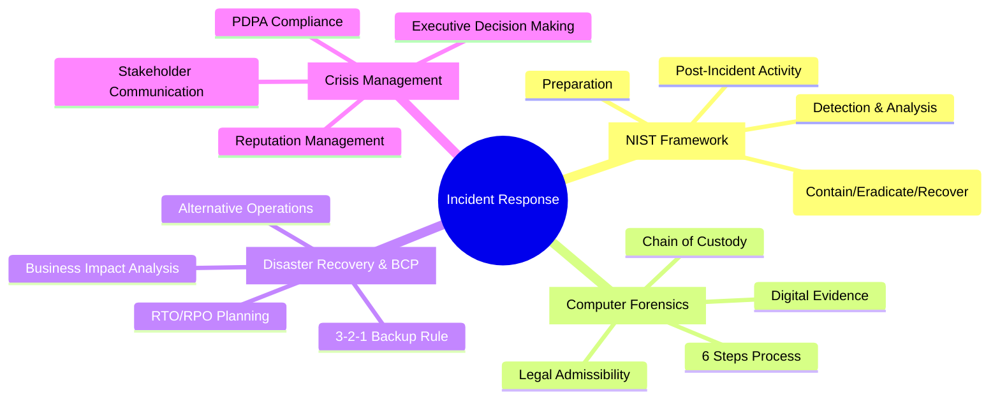

#### **สิ่งสำคัญที่ Software Engineers ต้องจำ:**

**1. เตรียมพร้อมสำคัญกว่าเครื่องมือ:**
- มี plan ชัดเจน > มีเครื่องมือแพง
- ฝึกซ้อมเป็นประจำ > เรียนรู้เมื่อเกิดเหตุ
- ทีมงานที่พร้อม > คนเก่ง 1 คน

**2. การสื่อสารเป็นศิลปะ:**
- CEO ต้องการ business impact
- Technical team ต้องการ root cause  
- ลูกค้าต้องการความโปร่งใส
- สื่อต้องการ statement ที่กระชับ

**3. กฎหมายซับซ้อนกว่าที่คิด:**
- PDPA: แจ้ง 72 ชม. แต่ "เมื่อรู้เหตุ" คือเมื่อไหร่?
- Chain of custody: เก็บหลักฐานผิดวิธี = ใช้ในศาลไม่ได้
- International: ข้อมูลข้ามประเทศ = หลาย jurisdiction

**4. การออกแบบระบบต้องคิด IR ตั้งแต่แรก:**
- Logging ที่ดี = ไขคดีได้เร็ว
- Monitoring ที่ชาญฉลาด = รู้ทันเหตุ
- Architecture ที่ยืดหยุ่น = กู้คืนได้ง่าย

### 🚀 Action Items สำหรับนักศึกษา

#### **ทำทันทีหลังเลิกเรียน (วันนี้):**
- [ ] Join Facebook group "Cyber Security Thailand"  
- [ ] Download Wireshark ลองดู network traffic ตัวเอง
- [ ] เขียน Personal Incident Response Plan (assignment)
- [ ] ติดตาม @thaicert และ @_dtam_th on Twitter

#### **สัปดาห์หน้า:**
- [ ] ดู YouTube: Professor Messer Security+ Incident Response  
- [ ] อ่าน: NIST SP 800-61 Rev. 2 (ย่อ ๆ สำหรับนักศึกษา)
- [ ] ลองใช้ ELK Stack ใน Docker
- [ ] ทำ TryHackMe: Blue Team challenges

#### **เดือนหน้า:**
- [ ] เข้าร่วม OWASP Bangkok meetup
- [ ] สมัครสอบ CompTIA Security+ (มี student discount)  
- [ ] เพิ่ม security logging ในโปรเจคส่วนตัว
- [ ] อ่าน case studies ของ data breaches ในไทย

#### **ปีหน้า:**
- [ ] หา internship ที่มี security team  
- [ ] เข้าร่วม InfoSec Thailand conference
- [ ] ได้ certification อย่างน้อย 1 ใบ
- [ ] Network กับคนในวงการผ่าน LinkedIn

### 💼 Career Advice

#### **สำหรับคนที่สนใจ Blue Team/Defensive Security:**

**ปี 4 (ก่อนจบ):**
```
📚 Academic:
- เลือก electives ที่เกี่ยวกับ network, database security
- โปรเจค senior ให้มีส่วน security monitoring  
- เข้า CTF แบบ Blue Team (CyberDefenders, Blue Team Labs)

💼 Professional:  
- หา part-time/internship ใน SOC หรือ IT security team
- ได้ CompTIA Security+ หรือ Google Cybersecurity Certificate
- Build portfolio: GitHub กับ security tools, write-ups
```

**หลังจบ (0-2 ปีแรก):**
```
🎯 Entry Positions:
- SOC Analyst Level 1: 25-35K เริ่มต้น
- Security Administrator: 30-45K เริ่มต้น  
- DevSecOps Engineer: 40-60K เริ่มต้น

📈 Growth Path:
Year 1-2: Learn tools, get GCIH certification
Year 3-5: Senior analyst, get CISSP  
Year 5+: Security architect, team lead, consultant
```

#### **สำหรับคนที่อยาก balance Dev + Security:**

**แนวทางการพัฒนา:**
```
🔀 Hybrid Career Path:
- Software Engineer with Security Mindset
- DevSecOps Engineer  
- Security-focused Full-stack Developer
- Application Security Engineer

🛠️ Skills Focus:
- Secure coding practices (OWASP Top 10)
- CI/CD security integration  
- Cloud security (AWS/Azure certified)
- Infrastructure as Code (Terraform + security)
```

### 📈 Industry Trends ที่ควรติดตาม

#### **เทคโนโลยีที่กำลังมา:**
- **AI-powered Security**: มากกว่าแค่ detection, ไปถึง automated response
- **Zero Trust Architecture**: ไม่เชื่อใครเลย, ตรวจสอบทุกครั้ง  
- **Cloud-Native Security**: Security สำหรับ containers, serverless
- **Privacy Engineering**: GDPR, PDPA compliance by design
- **Quantum-Safe Cryptography**: เตรียมพร้อมสำหรับ quantum computers

#### **Skills ที่จะสำคัญใน 5 ปีข้างหน้า:**
- **Cloud Architecture**: Multi-cloud, hybrid environments
- **Automation**: Python, Go, Infrastructure as Code  
- **AI/ML Literacy**: เข้าใจพื้นฐาน machine learning for security
- **Business Acumen**: เข้าใจผลกระทบทางธุรกิจ ไม่ใช่แค่เทคนิค
- **Soft Skills**: Communication, project management, leadership

### 🙏 ข้อความปิดท้าย

#### **ข้อคิดทิ้งท้าย:**

> **"The question is not if you will be breached, but when you will be breached and how well you will respond."**  
> — Kevin Mitnick, Security Consultant

**สิ่งที่อยากฝาก:**
- **Security เป็นเรื่องของทุกคน** ไม่ใช่แค่ security team  
- **มันคือ mindset** มากกว่า skillset
- **เรียนรู้ตลอดชีวิต** เพราะ threats เปลี่ยนแปลงตลอด
- **ชุมชน cybersecurity มีคนดี ๆ** อย่าลังเลสอบถาม

#### **ทรัพยากรสุดท้าย:**

**📚 หนังสือที่แนะนำ:**
- "The Phoenix Project" - DevOps และ IT Operations  
- "Incident Response & Computer Forensics" - Jason Luttgens
- "The Art of Deception" - Kevin Mitnick (Social Engineering)

**🎥 Documentary ที่น่าดู:**
- "Zero Days" (Stuxnet malware)
- "The Great Hack" (Cambridge Analytica)  
- "Privacy Uprising" (Digital privacy)

**🎧 Podcasts:**
- Darknet Diaries (เล่าเหตุการณ์โจมตีจริง)
- Security Now (ข่าวและเทคนิคล่าสุด)
- CyberWire Daily (ข่าวรายวัน)

### 📞 Contact Information

**สำหรับคำถามเพิ่มเติม:**
- 📧 **Email**: thanit@rmutl.ac.th
- 💬 **Office Hours**: จันทร์-ศุกร์ 14:00-16:00 น.  
- 📍 **Location**: ห้อง C3-301, อาคารเทคโนโลยีสารสนเทศ
- 📱 **Line ID**: @prof_cybersec (สำหรับคำถามด่วน)

**สำหรับการ์ยข่าย:**
- 🔗 **LinkedIn**: /in/cybersec-instructor-th
- 🐙 **GitHub**: @cybersec-education-th  
- 🐦 **Twitter**: @cybersec_prof_th

---

## 🎓 **ขอบคุณสำหรับความตั้งใจเรียน!**

### **สุดท้าย... คำถามสำคัญ:**
> หลังจากเรียนจบแล้ว เมื่อคุณกลายเป็น Software Engineer  
> คุณจะออกแบบระบบที่ปลอดภัยและพร้อมรับมือเหตุการณ์ได้ไหม?

### **ความท้าทายสำหรับคุณ:**
- พัฒนา security mindset  
- เป็น security champion ในทีม
- สร้าง culture ของ security awareness
- ช่วยทำให้ cyberspace ของไทยปลอดภัยขึ้น

## 🛡️ **Stay Safe, Stay Secure! 🇹🇭**

